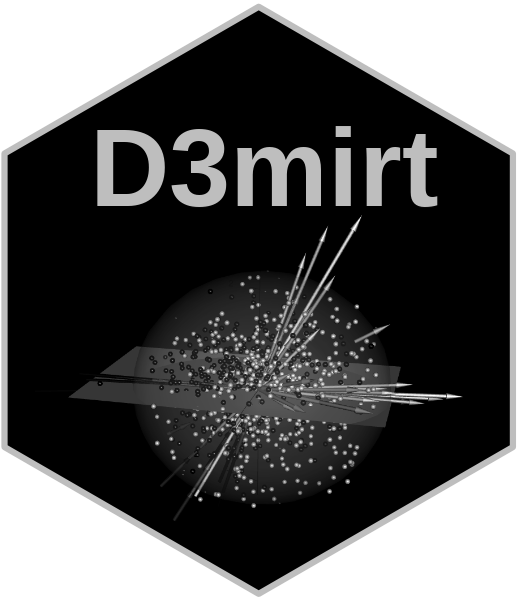

```{r, include = FALSE}
knitr::opts_chunk$set(
  collapse = TRUE,
  comment = "#>",
  fig.path = "man/figures/README-",
  out.width = "100%"
)
```

```{r setup, message = FALSE, include = FALSE}
library(D3mirt)
library(mirt)
```



# `D3MIRT` Modeling

The `D3mirt` analysis is based on descriptive multidimensional item response theory (DMIRT; Reckase2009, 1985; Reckase & McKinley, 1991) and can be used to analyze dichotomous and polytomous items (Muraki & Carlson, 1995) in a multidimensional ability space. The method is foremost visual and illustrates item characteristics, represented by vector arrows, located in a three-dimensional interactive space.

In DMIRT analysis, also called within multidimensional modeling, it is assumed that items in a multidimensional ability space can measure single or multiple latent traits (Reckase, 2009, 1985; Reckase & McKinley, 1991). The methodology is a type of data reduction technique that uses a compensatory model (Reckase, 2009), i.e., a model that assumes the existence of a multidimensional trait space forming an interconnected latent ability field. The method is *descriptive* because the results describe the extent to which items in a test are unidimensional, i.e., that the items describe one dimension only, or are within-multidimensional, i.e., that the items describe more than one dimension.

The DMIRT approach uses two types of item models, dependent on item type. If dichotomous items are used, the analysis is based on the two-parameter logistic model (2PL). If polytmous items are used, the analysis is based on the two-parameter graded response model (GRM; Samejima, 1969). The method is therefore limited to items that fit these item models.

The estimation process begins by first extracting two-parameters multidimensional equivalents to the discrimination $a$ and difficulty parameters $d$. The former becomes the multidimensional discrimination ($MDISC$) parameter and the latter the multidimensional difficulty ($MDIFF$) parameter.

The $MDIFF$ is interpreted similarly as the difficulty parameter in the unidimensional model, i.e., it shows the level of ability that is required for a higher or correct response. Note, if polytomous items are used, such as Likert items, the items in question will be represented by multiple vector arrows (one for each response function) and the $MDIFF$ will, therefore, show the multidimensional range of difficulty for an item as located in a multidimensional latent trait space.

The $MDISC$ shows the highest level of discrimination an item can achieve in the multidimensional model. In addition, the $MDISC$ score is also visualized in the graphical output by scaling the length of the vector arrows representing the item response functions.

The `D3mirt` can also perform analysis of psychological constructs. Constructs, in this context, refer to the assumption that a subset of items can measure a higher-order latent variable. If constructs are used, the output will include reporting of the directional discrimination ($DDISC$) parameter that shows how well the items discriminate under the assumption that they measure one of the constructs used in the analysis. Importantly, while the $MDISC$ represents the maximum level of discrimination in the model, the $DDISC$ represents the local discrimination that makes it possible to compare item discrimination in a specific direction set by the constructs.

# Overview

The package includes the following functions.

-   `modid()`: D3mirt Model Identification
-   `D3mirt()`: 3D DMIRT Model Estimation
-   `summary()`: Summary Function for `D3mirt()`
-   `plotD3mirt`: Graphical Output for `D3mirt()`

## Installation

You can install the development version of D3mirt from [GitHub](https://github.com/) with:

``` r
# install.packages("devtools")
devtools::install_github("ForsbergPyschometrics/D3mirt")
```

In what follows, the `D3mirt` procedure will be described very briefly using the built-in data set "anes08_09offwaves". The data set ($N = 1046, M_{age} = 51.33, SD = 14.56, 57\%$ Female) is a subset from the American National Election Survey (ANES) from the 2008-2009 Panel Study Off Wave Questionnaires, December 2009 (DeBell, et al, 2010; <https://electionstudies.org/data-center/2008-2009-panel-study/>). All items measure moral preferences and are positively scored of Likert type, ranging from 1 = *Strongly Disagree* to 6 = *Strongly Agree*. Demographic variables include age and gender (male/female).

The D3mirt approach largely consists of the following three steps:

1.  Model Identification
2.  D3mirt model estimation
3.  Plotting

For more details on the `D3mirt` package, including extended examples of analysis and functions, please see the vignette included in the package documentation.

# 1. Model Identification

As a first step in the analysis, the three-dimensional compensatory model must be identified (Reckase, 2009). In the three-dimensional case, this implies locating the $x$ and $y$-axis by selecting two items from the item set. The first item should not load on the second and third axes ($y$ and $z$), while the second item should not load on the third axis ($z$).

If the model is not known beforehand it is necessary to explore the data with exploratory factor analysis (EFA), preferably with the help of the EFA option in `mirt::mirt` (Chalmers, 2012) using `ìtemtype = 'graded'` or `'2PL'`. Note, the EFA is only used to find model identification items that meet the necessary DMIRT model specification requirements. The EFA model itself is discarded after this step in the procedure.

```{r, message = FALSE, results = 'hide'}
# Load data
data("anes08_09offwaves")
x <- anes08_09offwaves
x <- x[,3:22] # Remove columns for age and gender

# Fit a three-factor EFA model with the mirt package
f <- mirt::mirt(x, 3, itemtype = 'graded')

# Assign data frame with factor loadings with oblimin rotation
g <- summary(f, rotate= 'oblimin')
h <- data.frame(g$rotF)
```

The `modid()` takes in the factor solution from the EFA, assigned to a data frame $h$, and outputs an $S3$ object of class `modid` containing lists with data frames of estimates. The most important is the item lists, (denoted `$id`), containing data frames that present suggestions on what items (`item.1`...`item.n`) to use for the model identification. The data frames have one column for the loadings from each item on the factor of interest, and one column with absolute sum scores (denoted `ABS`) for each item calculated from the remaining factor loadings in the model. Each item list is sorted with the lowest absolute sum score highest up. Consequently, the top items in each list are the items that best meet the necessary statistical requirements for model identification. Therefore, for a three-dimensional model, all else equal, the item highest up in the first list should be used to identify the $x$-axis, and the item highest up in the second list should be used to identify the $y$-axis, and so on.

```{r}
# Call to modid()
modid(h)
```

As can be seen, the first item, that will be used to identify the $x$-axis, is found in the first list, `id[[1]]` and `item.1`. In this case, the best item for the $x$-axis is item "W7Q3". The item that identifies the $y$-axis is found in the next list, `id[[2]]` and `Item.2`. In this case, the best item for the $y$-axis is item "W7Q20".

If problems appear with the model identification, please see the package vignette for guidance.

# 2. D3mirt Model Estimation

The `D3mirt()` function takes in a data frame with model parameters from a three-dimensional compensatory model and returns an $S3$ object of class `D3mirt` with lists of $a$ and $d$, $MDISC$, and $MDIFF$ parameters, direction cosines, and spherical coordinates. Regarding the latter, spherical coordinates are represented by $\theta$ and $\phi$ ($\rho = 1$). The $\theta$ coordinate is the positive or negative angle in degrees, starting from the $x$-axis, of the vector projections from the vector arrows in the $xz$-plane up to $\pm 180°$. Note, the $\theta$ angle is oriented following the positive pole of the $x$ and $z$ axis so that the angle increases clockwise in the graphical output. The $\phi$ coordinate is the positive angle in degrees from the $y$-axis and the vectors.

If constructs are used, the function also returns construct direction cosines, spherical coordinates for the construct vector arrows, and $DDISC$ parameters (one index per construct).

The three-dimensional compensatory model is specified so that all items load on all three factors in the model, and that the factors are constrained to be orthogonal (see below). The fitting of the model is preferably done with the `mirt::mirt` (Chalmers, 2012) function. Please note very carefully regarding the model specification in the example below.

```{r, message = FALSE, results = 'hide'}
# Load data
data("anes08_09offwaves")
x <- anes08_09offwaves
x <- x[,3:22] # Remove columns for age and gender

# Fit a three-dimensional graded response model with orthogonal factors
# Example below uses Likert items from the built-in data set "anes08_09offwaves"
# Item W7Q3 and item W7Q20 was selected with `modid()`
# The model specification set all items in the data set (1-20) 
# to load on all three factors (F1-F3)
# The START and FIXED commands are used on the two items to identify the DMIRT model
 spec <- ' F1 = 1-20
           F2 = 1-20
           F3 = 1-20

           START=(W7Q3,a2,0)
           START=(W7Q3,a3,0)

           START=(W7Q20,a3,0)

           FIXED=(W7Q3,a2)
           FIXED=(W7Q3,a3)

           FIXED=(W7Q20,a3) '


mod1 <- mirt::mirt(x, 
                   spec, 
                   itemtype = 'graded', 
                   SE = TRUE, 
                   method = 'QMCEM')

# Assign a data frame with factor loadings (located in the first three columns in mod1),
# and difficulty parameters (columns 4-8 in mod1) with mirt::coef and $'items'[,1:8]))
d <- data.frame(mirt::coef(mod1, 
                           simplify=TRUE)$'items'[,1:8])
```

Constructs can be included in the analysis by creating one or more nested lists that indicate what items belong to what construct. From this, the `D3mirt()` function finds the average direction of the subset of items contained in each construct list by adding and normalizing the direction cosines for the items. Note, the length of the vector arrows is arbitrary and can be user adjusted.

The construct vector arrows can contribute to the analysis by (a) visualizing the average direction for a subset set of items, and (b) by showing how combinations of items interrelate at group-level.

The `D3mirt()` function call is straightforward. The output, however, is lengthy so the use of the summary function when inspecting the results is recommended.

```{r}
# Call to D3mirt(), including optional nested lists for three constructs
# Item W7Q16 is not included in any construct because of model violations
# The model violations for the item can be seen when plotting the model
c <- list(list (1,2,3,4), 
          list(5,7,8,9,10), 
          list(11,12,13,14,15,15,16,17,18,19,20))
g <- D3mirt(d, c)
summary(g)
```

# 3. Plotting

## The `plotD3mirt` Function

The `plotD3mirt` function is built on the `rgl` package (Adler & Murdoch, 2023) for visualization with OpenGL. Graphing in default mode by calling `plotd3mirt` will return an RGL device that will appear in an external window as a three-dimensional object, containing vector arrows with the latent dimensions running along the orthogonal axes, that can be rotated. In this illustration, however, all RGL devices are plotted inline as still shots.

```{r, eval = FALSE}
# Plot RGL device with constructs visible and named
plotD3mirt(g, 
           constructs = TRUE, 
           construct.lab = c("Fairness", "Conformity", "Compassion"))
```


An example of how the output can be described could be as follows.

> As can be seen, the item vector clustering patterns in Figure $X$ indicate the presence of foremost two latent dimensions, one aligned with the $x$-axis and one approaching the $y$-axis. The two dimensions, however, seem to have some within-multidimensional tendencies since they are not completely orthogonal. This tendency, however, is much more prominent for the items W7Q11, W7Q12, W7Q13, and W7Q14, being located at around $\theta = 45°$ or higher between the $x$ and $z$-axis. Moreover, the angles of the constructs informs us that Compassion ($\theta = 1.710°, \phi = 86.486°$) and Conformity ($\theta = -2.519°,\phi = 28.192°$) have some within-multidimensional tendencies. However, they are both more or less orthogonal to the $z$-axis ($\theta = 1.710°$ and $\theta = -2.519°$ respectively). Next, we find Fairness ($\theta = 49.106°, \phi = 78.308°$) with clear within-multidimensional tendencies with respect to the $x$-axis. Thus, the output indicates that Compassion and Conformity could be independent constructs but that Fairness seems not to be.

As was mentioned above, the W7Q16 had the most measurement problems of all items in the data. Foremost, the short vector arrows indicate high amounts of model violations. Moreover, the location of the item in the model also indicates that the item is within-multidimensional and that it does not seem to belong to any construct explicitly.

The `plotD3mirt()` function allows plotting W7Q16 alone using argument `items` and by entering the number indicating where the item appears in the data set (see `?anes08_09offwaves`).

```{r, eval = FALSE}
# Item W7Q16 has location 6 in the data set (gender and age excluded)
# The item is plotted together with construct to aid the visual interpretation
plotD3mirt(g, 
           constructs = TRUE, 
           items = 6, 
           construct.lab = c("Fairness", "Conformity", "Compassion"), 
           view = c(15, 20, 0.6))
```


An example of how the output can be described could be as follows.

> Figure $X$ shows that item W7Q16 is located at $\theta = 16.083°, \phi = 57.473°$, which indicates that the item is within-multidimensional with respect to the $x$ and $y$-axis but approaching orthogonal tendencies with respect to the $z$-axis. In addition, the directional discrimination further underscores that the item does not seem to measure any particular construct ($DDISC_1 = .656, DDISC_2 = .656, DDISC_3 = .617$). The global discrimination score ($MDISC = .770, MDIFF_{range} = [-4.838, 2.349]$) is also the lowest of all discrimination scores in the model. This, combined, implies that the item in question does not seem to fit the three-dimensional compensatory model used in this analysis. We should also note that item W7Q15 ($MDISC = .923, MDIFF_{range} = [-4.680, 1.051]$) has the second lowest discrimination score. However, the latter item does seem to belong to the Conformity construct when comparing angle orientation ($\theta = -19.436°, \phi = 31.516°$) and discrimination ($MDISC = .923, DDISC_1 = .332, DDISC_2 = .912, DDISC_3 = .497$).

## `D3mirt` Profile Analysis

The `plotD3mirt()` function can also display respondents in the three-dimensional model represented as spheres located with respondent factors scores used as coordinates. This allows for a profile analysis in which respondent rows can be selected conditioned on single or multiple criteria and then plotted. The resulting output shows where the respondents are located in the model, and, accordingly, what model profile best describes them. Similarly, respondent categories can be simultaneously compared to see if a group-level effect can be visually observed.

To do this, the user must first extract respondent factor scores with `mirt::fscores` (Chalmers, 2012) and then select a subset of respondent rows based on one or more criteria. The resulting data frame is imputed in the `profiles` argument. Generally, it can be useful to hide vector arrows with `hide = TRUE` when plotting respondent profiles to avoid visual cluttering. The example below separates respondents using the gender variable included in the built-in data set.

```{r}
# Extract respondent factor scores from mod1 with fscores() function from [mirt::mirt]
f <- mirt::fscores(mod1, 
                   method="EAP", 
                   full.scores = TRUE, 
                   full.scores.SE = F, QMC = T)

# Attach f to the gender variable (column 2 from anes08_09offwaves data set; "W3XGENDER")
# Use cbind with fscores() output attached first
data("anes08_09offwaves")
x <- anes08_09offwaves
z <- data.frame(cbind(f, x[,2]))
```

The `plotD3mirt` function uses `as.factor()` to count the number of factor levels in the data imputed in the `levels` argument. This means that raw data can be used as is but the number of colors in the color vectors argument (`sphere.col`) may need to be adapted. In the example below, the criteria variable for gender only hold two factor levels and therefore only two colors in the color vector are needed.

Call `plotD3mirt` with the respondent data frame $z$ in the `profiles` argument and the `levels` argument with the levels column subsetted from $z$.

```{r, eval = FALSE}
# Plot profiles with item vector arrows hidden with hide = TRUE
# Score levels: 1 = Blue ("male") and 2 = Red ("female")
plotD3mirt(g, hide = TRUE, 
           profiles = z, 
           levels = z[,4], 
           sphere.col = c("blue", "red"), 
           x.lab = "Compassion", 
           y.lab="Conformity", 
           z.lab="Fairness")
```


An example of how the output can be described could be as follows.

> In the graphical output, it can be observed a simple profile on gender in which more women tend to have higher levels of trait on Compassion. When rotating the model, there seems not to be any observable gender difference related to Conformity or Fairness.

# Exporting The RGL Device

Some options for exporting the RGL device are shown below. Over and above these, it is also possible to export graphical devices in R Markdown documents with `rgl::hookwebgl()` together with graphical options for knitr, as was done when creating this vignette.

```{r, eval = FALSE}
# Export an open RGL device to the console that can be saved as a html or image file
plotD3mirt(g, 
           constructs = TRUE)
s <- scene3d()
rgl::rglwidget(s, 
               width = 1040, 
               height = 1040)

# Export a snap shoot of an open RGL device directly to file
plotD3mirt(g, 
           constructs = TRUE)
rgl::snapshot3d('RGLdevice.png', 
                    fmt = 'png')
```

# Getting Help and Reporting Bugs

If you encounter a bug, please file an issue with a minimal reproducible example on GitHub (<https://github.com/ForsbergPyschometrics/D3mirt>). For questions please contact me on Github or via email ([forsbergpsychometrics\@gmail.com](mailto:forsbergpsychometrics@gmail.com){.email}).

# References

Adler, D., & Murdoch, D. (2023). *Rgl: 3d Visualization Using OpenGL* [Computer software]. <https://dmurdoch.github.io/rgl/index.html>

Chalmers, R., P. (2012). mirt: A Multidimensional Item Response Theory Package for the R Environment. *Journal of Statistical Software, 48*(6), 1-29.

DeBell, M., Krosnick, J. A., & Lupia, A.(2010). *Methodology Report and User's Guide for the 2008--2009 ANES Panel Study*. Palo Alto, CA, and Ann Arbor, MI: Stanford University and the University of Michigan.

Muraki, E., & Carlson, J. E. (1995). Full-Information Factor Analysis for Polytomous Item Responses. *Applied Psychological Measurement, 19*(1), 73--90. <https://doi.org/10.1177/014662169501900109>

Reckase, M. D.(2009).*Multidimensional Item Response Theory*. Springer.

Reckase, M. D.(1985). The Difficulty of Test Items That Measure More Than One Ability. *Applied Psychological Measurement, 9*(4),401-412.<https://doi-org.ezp.sub.su.se/10.1177/014662168500900409>

Reckase, M. D., & McKinley, R. L. (1991). The Discriminating Power of Items That Measure More Than One Dimension. *Applied Psychological Measurement, 15*(4), 361-373. <https://doi-org.ezp.sub.su.se/10.1177/014662169101500407>

Samejima, F. (1969). Estimation of latent ability using a response pattern of graded scores. *Psychometrika 34*, 1-97.<https://doi.org/10.1007/BF03372160>
