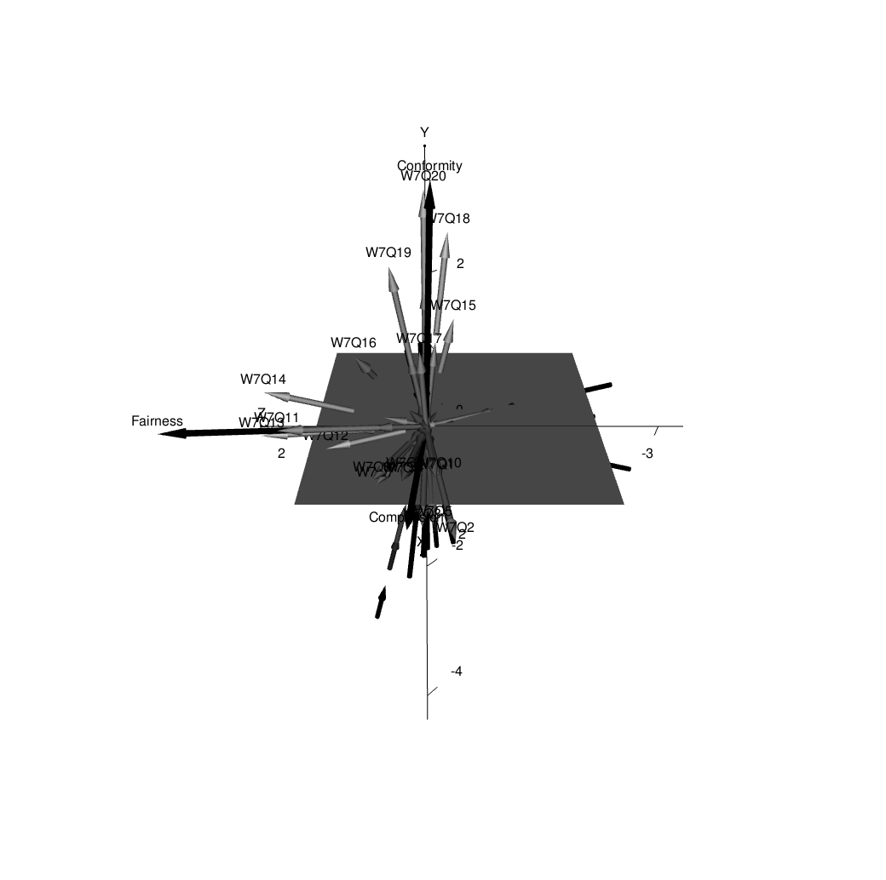

```{r, include = FALSE}
knitr::opts_chunk$set(
  collapse = TRUE,
  comment = "#>",
  fig.path = "man/figures/README-",
  out.width = "100%"
)
```

```{r setup, message = FALSE, include = FALSE}
library(D3mirt)
```

::: {align="center"}

:::

# `D3MIRT` Modeling

The `D3mirt` analysis is based on descriptive multidimensional item response theory (DMIRT; Reckase, 2009, 1985; Reckase & McKinley, 1991) and can be used to analyze dichotomous and polytomous items (Muraki & Carlson, 1995) in a three-dimensional ability ($\theta$) space. The method is foremost visual and illustrates item characteristics with the help of vector geometry in which items are represented by vector arrows.

In DMIRT analysis, also called within multidimensional modeling, it is assumed that items in a multidimensional ability space can measure single or multiple latent traits (Reckase, 2009, 1985; Reckase & McKinley, 1991). The methodology is a type of data reduction technique based on the compensatory model (Reckase, 2009), i.e., a type of measurement model that uses linear combinations of $\theta$-values for ability assessment. The method seeks to maximize item discrimination and so is *descriptive* because the results describe the extent to which items in a test are unidimensional, i.e., that the items discriminate on one dimension only, or are within-multidimensional, i.e., that the items discriminate on more than one dimension.

Regarding vector orientation, the angle of the vector arrows indicates what traits, located along the orthogonal axes in the model, an item can be said to describe (Reckase, 2009, 1985, Reckase & McKinley, 1991). For instance, in a two-dimensional space, an item is *unidimensional* if its item vector arrow is at $0°$ with respect to one of the axes in the model, and $90°$ with respect to the other. Such an item describes a singular trait only. In contrast, an item is *within-multidimensional* if its item vector arrow is oriented at $45°$ in relation to the axes in the model. Such an item describes both traits in the model equally well. The same criteria are extended to the three-dimensional case.

The DMIRT approach uses two types of item models, dependent on item type. If dichotomous items are used, the analysis is based on the multidimensional two-parameter logistic model (M2PL). If polytomous items are used, the analysis is based on the multidimensional two-parameter graded response model (MGRM; Muraki & Carlson, 1995). The method is therefore limited to items that fit these item models.

The estimation process begins by first fitting and extracting the discrimination $a$ and difficulty parameters $d$ from a compensatory model. Next, the DMIRT estimation uses the former to compute the multidimensional discrimination ($MDISC$) parameter and the multidimensional difficulty ($MDIFF$) parameter that is used to locate the items in a vector space.

The $MDIFF$ is interpreted similarly as the difficulty parameter in the unidimensional model, i.e., it shows the level of ability that is required for a higher or correct response. Note, if polytomous items are used, such as Likert items, the items will be represented by multiple vector arrows (one for each response function). The $MDIFF$ will, in such a case, show the multidimensional range of difficulty for an item as located in a multidimensional latent trait space.

The $MDISC$ shows the highest level of discrimination an item can achieve in the multidimensional model. It is, therefore, a global item characteristic assuming a multidimensional latent space. In addition, the $MDISC$ score is visualized in the graphical output by scaling the length of the vector arrows representing the item response functions, such that longer arrows indicate higher discrimination (and vice versa).

A novel theoretical contribution to DMIRT is the use of constructs in the `D3mirt` functions. Constructs, in this context, refer to the assumption that a subset of items can measure a higher-order latent variable. In `D3mirt`, constructs are implemented as optional vectors whose orientation is calculated as the average direction, i.e., the average multidimensional discrimination of a subset of items (from one item to all items in the set) in the model. A construct vector will, therefore, point in the direction of the maximum slope of an imaginary item response function indicated by the items chosen by the user.

If constructs are used, the output will include reporting of the directional discrimination ($DDISC$) parameter that shows how well the items discriminate under the assumption that they measure one of the constructs used in the analysis. That is, while the $MDISC$ represents the maximum level of discrimination in the model, the $DDISC$ represents the local discrimination that makes it possible to compare item discrimination in a specific direction set by the constructs. The constructs are, therefore, like unidimensional models nested in the multidimensional latent space and are visually represented with construct vector arrows scaled to an arbitrary length.

# Overview

The package includes the following main functions.

-   `modid()`: D3mirt Model Identification
-   `D3mirt()`: 3D DMIRT Model Estimation
-   `plot()`: Graphical Output for `D3mirt()`

## Installation

You can install the `D3mirt` package from CRAN, or try the development version of the package, by using the following codes for `R`.

```{r, eval = FALSE}
# Install from CRAN depository
install.packages('D3mirt')

# Install development version from Github
# install.packages("devtools")
# To include package vignette in the installation add: build_vignettes = TRUE
devtools::install_github("ForsbergPyschometrics/D3mirt")
```

In what follows, the `D3mirt` procedure will be described very briefly using the built-in data set "anes0809offwaves". The data set ($N = 1046, M_{age} = 51.33, SD = 14.56, 57\%$ Female) is a subset from the American National Election Survey (ANES) from the 2008-2009 Panel Study Off Wave Questionnaires, December 2009 (DeBell, et al, 2010; <https://electionstudies.org/data-center/2008-2009-panel-study/>). All items measure moral preferences and are positively scored of Likert type, ranging from 1 = *Strongly Disagree* to 6 = *Strongly Agree*. Demographic variables include age and gender (male/female).

The D3mirt approach largely consists of the following three steps:

1.  Model Identification
2.  D3mirt model estimation
3.  Plotting

For more details on the `D3mirt` package, including extended examples of analysis and functions, please see the vignette included in the package documentation.

# 1. Model Identification

As a first step in the analysis, the three-dimensional compensatory model must be identified (Reckase, 2009). In the three-dimensional case, this implies locating the $x$ and $y$-axis by selecting two items from the item set. The first item should not load on the second and third axes ($y$ and $z$), while the second item should not load on the third axis ($z$).

If the model is not known beforehand it is necessary to explore the data with exploratory factor analysis (EFA), preferably with the help of the EFA option in `mirt::mirt` (Chalmers, 2012), using `ìtemtype = 'graded'` or `'2PL'`. Note, the EFA is only used to find model identification items that meet the necessary DMIRT model specification requirements. The EFA model itself is discarded after this step in the procedure. This implies that the rotation method is less crucial and the user is encouraged to try different rotation methods and compare the results.

Note, all outputs from functions from the `mirt` package are available as ready-made package files that can be loaded directly into the R session.

```{r, message = FALSE, results = 'hide', eval = FALSE}
# Load data
data("anes0809offwaves")
x <- anes0809offwaves
x <- x[,3:22] # Remove columns for age and gender
```

The `modid()` can take in raw item data or a data frame with item factor loadings. In the default mode (`efa = TRUE`) using raw data, the function performs an EFA, with three factors as default (`factors = 3`), and then finishes with the model identification. If, however, item factor loadings are already available, the function can jump directly to the model identification by setting `efa = FALSE`.

The output consists of an $S3$ object of class `modid` containing data frames with model identification items, order of factor strength (based on sum of squares), and item factor loadings. The function has two arguments: the *lower* and *upper* bound. In brief, the lower bound increase the item pool used in the procedure while the upper bound acts as a filter that removes items that do not meet the necessary statistical requirements. This implies that the upper bound should not, in general, be manipulated.

The `summary()` function prints the number of items and the number of factors used in the analysis together with the suggested model identification items. As can be seen, the items suggested by `modid()` are the items "W7Q3" and "W7Q20". The output also includes data frames that hold all the model identification items (`Item.1...Item.n`) selected by `modid()` together with the items' absolute sum score (`ABS`), one frame for the sum of squares for factors sorted in descending order, and one frame for item factor loadings. The order of the factors follows the model identification items so that item 1 comes from the strongest factor (sorted highest up), item 2 from the second strongest (sorted second), and so on.

The absolute sum scores indicate statistical fit to the structural assumptions of the DMIRT model and the items are, therefore, sorted with the lowest absolute sum score highest up. The top items are the items that best meet the necessary statistical requirements for the model identification. For a three-dimensional model this implies that the item highest up in the first data frame should be used to identify the $x$-axis, and the item highest up in the second data frame should be used to identify the $y$-axis, and so on.

```{r}
# Optional: Load the EFA data for this example directly from the package file
load(system.file("efa.Rdata", package = "D3mirt"))

# Call to modid() with h, containing factors scores from EFA
# Observe that the efa argument is set to false 
# The former is because item factor loadings are contained in x
a <- modid(x, efa = FALSE)
summary(a)
```

The `summary()` function prints the number of items and the number of factors used in the analysis together with the suggested model identification items. As can be seen, the items that are suggested by `modid()` to identify the model are the items "W7Q3", for the $x$-axis, and "W7Q20", for the $y$-axis.

The `modid()` is designed so that the strongest loading item, from the strongest factor, always aligns perfectly with the x-axis, and the remaining items follow thereafter. This helps makes the result maximally interpretable while also avoiding, with the help of the upper bound, imposing an unempirical structure on the data. If problems appear with the model identification, please see the package vignette for guidance.

# 2. D3mirt Model Estimation

The `D3mirt()` function takes model parameters from a three-dimensional compensatory model (either in the form of a data frame or an S4 object of class 'SingleGroupClass' exported from the `mirt()` (Chalmers, 2012) function) and returns an $S3$ object of class `D3mirt` with lists of $a$ and $d$, $MDISC$, and $MDIFF$ parameters, direction cosines, and spherical coordinates. Regarding the latter, spherical coordinates are represented by $\theta$ and $\phi$. The $\theta$ coordinate is the positive or negative angle in degrees, starting from the $x$-axis, of the vector projections from the vector arrows in the $xz$-plane up to $\pm 180°$. Note, the $\theta$ angle is oriented following the positive pole of the $x$ and $z$ axis so that the angle increases clockwise in the graphical output. The $\phi$ coordinate is the positive angle in degrees from the $y$-axis and the vectors. Note, the $\rho$ coordinate from the spherical coordinate system is in DMIRT represented by the MDIFF, and so is reported separately.

If constructs are used, the function also returns construct direction cosines, spherical coordinates for the construct vector arrows, and $DDISC$ parameters (one index per construct).

The three-dimensional compensatory model is specified so that all items load on all three factors in the model, and that the factors are constrained to be orthogonal (see below). The fitting of the model is preferably done with the `mirt()` (Chalmers, 2012) function. Please note very carefully regarding the model specification in the example below.

```{r, message = FALSE, results = 'hide', eval = FALSE}
# Load data
data("anes0809offwaves")
x <- anes0809offwaves
x <- x[,3:22] # Remove columns for age and gender

# Fit a three-dimensional graded response model with orthogonal factors
# Example below uses Likert items from the built-in data set "anes0809offwaves"
# Item W7Q3 and item W7Q20 was selected with modid()
# The model specification set all items in the data set (1-20) 
# to load on all three factors (F1-F3)
# The START and FIXED commands are used on the two items to identify the DMIRT model
 spec <- ' F1 = 1-20
           F2 = 1-20
           F3 = 1-20

           START=(W7Q3,a2,0)
           START=(W7Q3,a3,0)

           START=(W7Q20,a3,0)

           FIXED=(W7Q3,a2)
           FIXED=(W7Q3,a3)

           FIXED=(W7Q20,a3) '

mod.1 <- mirt::mirt(x, 
                   spec, 
                   itemtype = 'graded', 
                   SE = TRUE, 
                   method = 'QMCEM')
```

Constructs can be included in the analysis by creating one or more nested lists that indicate what items belong to what construct. Such a nested list can contain all items in the set down to a single item. From this, the `D3mirt()` function finds the average direction of the subset of items contained in each nested list by adding and normalizing the direction cosines for the items and scaling the construct direction vector to an arbitrary length (length can be adjusted by the user) so that the arrows can be seen when plotting.

The construct vector arrows can contribute to the analysis by (a) visualizing the average direction for a subset set of items, and (b) showing how all items discriminate locally in the direction of the construct vector with the help of the $DDISC$ index.

In this example, the S4 object `mod.1` from the `mirt` estimation above is used directly in the call to `D3mirt()`, and the `summary()` function, included in the package, is used to inspect the DMIRT estimates. The constructs included below were grouped based on exploratory reasons, i.e., because these items cluster in the model (observable in the graphical output below).

```{r}
# Optional: Load the mod.1 data for this example directly from the package file
load(system.file("mod.1.Rdata", package = "D3mirt"))

# Call to D3mirt(), including optional nested lists for three constructs
# Item W7Q16 is not included in any construct because of model violations
# The model violations for the item can be seen when plotting the model
c <- list(list(1,2,3,4,5,6,7,8,9,10),
          list(11,12,13,14),
          list(15,17,18,19,20))
g <- D3mirt(mod.1, c)
summary(g)
```

The `D3mirt()` function prints a short report containing the number of items used and the levels of difficulty of the items when the estimation is done. As can be seen, when construct vectors are used, the function also prints the number of construct vectors and the names of the items included in each construct. Next, the factor loadings and the difficulty parameters from the compensatory model are reported in data frames followed by all necessary DMIRT estimates.

# 3. Plotting

## The `plot()` Function

The `plot()` method for objects of class `D3mirt` is built on the `rgl` package (Adler & Murdoch, 2023) for visualization with OpenGL. Graphing in default mode by calling `plot()` will return an RGL device that will appear in an external window as a three-dimensional interactive object, containing vector arrows with the latent dimensions running along the orthogonal axes, that can be rotated. In this illustration, however, all RGL devices are plotted inline as still shots from two angles, $15^{\circ}$ (clockwise; default plot angle) and $90^{\circ}$. To change the plot output to $90^{\circ}$, use the `view` argument in the `plot()` function and change the first indicator from $15$ to $90$.

```{r, eval = FALSE}
# Plot RGL device with constructs visible and named
plot(g, constructs = TRUE, 
        construct.lab = c("Compassion", "Fairness", "Conformity"))
```

Figure 1: Three-dimensional vector plot for all items and the three constructs Compassion, Fairness, and Conformity (solid black arrows) plotted with the model rotated $15^{\circ}$ clockwise.

Figure 2: Three-dimensional vector plot for all items and the three constructs Compassion, Fairness, and Conformity (solid black arrows) plotted with the model rotated $90^{\circ}$ clockwise.

An example of how the output can be described could be as follows.

> As can be seen in Figures 1 and 2, the pattern in the data indicates the presence of foremost two main nested latent constructs indicated by the items, one aligned with the $x$-axis and one approaching the $y$-axis. We might also suspect the presence of a third construct located close to the $xy$-plane, between the $x$ and $z$ axes. Studying the content of the items, the labels *Compassion*, *Fairness*, and *Conformity* were introduced. The angles of the constructs inform us that Compassion ($\theta = 2.092^{\circ}$, $\phi = 86.061^{\circ}$) and Conformity ($\theta = -2.514 ^{\circ}$, $\phi = 28.193^{\circ}$) have some within-multidimensional tendencies. However, they are both more or less orthogonal to the $z$-axis. Next, we find Fairness ($\theta = 49.101^{\circ}$, $\phi = 78.313^{\circ}$) with clear within-multidimensional tendencies with respect to the $x$-axis. Thus, the output indicates that Compassion and Conformity could be independent constructs but that Fairness seems not to be.

As was mentioned above, the W7Q16 was not included in any of the constructs because the item showed signs of measurement problems. For example, the short vector arrows indicate high amounts of model violations and the location of the item in the model also indicates that the item is within-multidimensional and that it does not seem to belong to any construct explicitly.

The `plot()` function allows plotting W7Q16 in isolation using the argument `items` and by entering the number indicating where the item appears in the data set (see `?anes0809offwaves`).

```{r, eval = FALSE}
# Item W7Q16 has location 16 in the data set (gender and age excluded)
# The item is plotted together with construct to aid the visual interpretation
plot(g, constructs = TRUE, 
        items = 16, 
        construct.lab = c("Compassion", "Fairness", "Conformity"))
```

Figure 3: The item W7Q16 plotted with the three constructs and with the model rotated $15^{\circ}$ clockwise.

Figure 4: The item W7Q16 plotted with the three constructs and with the model rotated $90^{\circ}$ clockwise.

An example of how the output can be described could be as follows.

> The Figures 3 and 4 shows that item W7Q16 is located at $\theta = 16.085^{\circ}$, $\phi = 57.476^{\circ}$, indicating that the item is within-multidimensional with respect to the $x$ and $y$-axis; but much less so with respect to the $z$-axis. In addition, the directional discrimination further underscores that the item does not seem to measure any particular construct ($DDISC_1 = .657$, $DDISC_2 = .617$, $DDISC_3 = .656$). The global discrimination ($MDISC = .770$, $MDIFF_{range} = [-4.838, 2.349]$) is also the lowest of all discrimination scores in the model. This, combined, implies that the item in question does not seem to fit the three-dimensional DMIRT model used in this analysis and should therefore be removed or adapted. On a side note, we can also note that item W7Q15, $MDISC = .923$, $MDIFF_{range} = [-4.680, 1.051]$) has the second lowest global discrimination score. However, this item does seem to belong to the Conformity construct, observable when comparing angle orientation ($\theta = -19.432^{\circ}, \phi = 31.515^{\circ}$) and direction discrimination ($DDISC_1 = .502$, $DDISC_2 = .332$, $DDISC_3 = .912$).

## `D3mirt` Profile Analysis

The `plot()` function can also display respondents in the three-dimensional model represented as spheres located using respondent factors scores used as coordinates. This allows for a profile analysis in which respondents can be separated, or subset, conditioned on single or multiple criteria and then plotted. The resulting output shows where the respondents are located in the model, and, accordingly, what model profile best describes them. Similarly, respondent categories can be simultaneously compared to see if a group-level effect can be visually observed.

To do this, the user must first extract respondent factor scores with `fscores()` (Chalmers, 2012) and then separate or select a subset of respondent rows based on one or more criteria. The resulting data frame is imputed in the `profiles` argument. Generally, it can be useful to hide vector arrows with `hide = TRUE` when plotting respondent profiles to avoid visual cluttering. The example below separates respondents using the gender variable included in the built-in data set.

```{r, eval = FALSE}
# Extract respondent factor scores from mod1 with fscores()
f <- mirt::fscores(mod1, 
                   method="EAP", 
                   full.scores = TRUE, 
                   full.scores.SE = FALSE, QMC = TRUE)
```

```{r}
# Optional: Load the respondent factor scores for this example directly from the package file
load(system.file("fscores.Rdata", package = "D3mirt"))

# Attach f to the gender variable (column 2 from anes0809offwaves data set; "W3XGENDER")
# Use cbind with fscores() output attached first
data("anes0809offwaves")
x <- anes0809offwaves
z <- data.frame(cbind(f, x[,2]))
```

The `plot()` function uses `as.factor()` to count the number of factor levels in the data imputed in the `levels` argument. This means that raw data can be used as is but the number of colors in the color vectors argument (`sphere.col`) may need to be adapted. In the example below, the criteria variable for gender only hold two factor levels and therefore only two colors in the color vector are needed.

Call `plot()` with the respondent data frame $z$ in the `profiles` argument and the `levels` argument with the levels column subset from $z$. In the function call below, the axes in the model are named using the `x.lab`, `y.lab`, and `z.lab` arguments following the direction of the constructs. Note, the model axes represent unidimensional singular structures, or traits, in this case borrowing the names of the constructs.

```{r, eval = FALSE}
# Plot profiles with item vector arrows hidden with hide = TRUE
# Score levels: 1 = Blue ("male") and 2 = Red ("female")
plot(g, hide = TRUE, 
     profiles = z, 
     levels = z[,4], 
     sphere.col = c("blue", "red"), 
     x.lab = "Compassion", 
     y.lab="Conformity", 
     z.lab="Fairness")
```

Figure 5: Gender profile for the `anes0809offwaves` data set plotted with the model rotated $15^{\circ}$ clockwise.

Figure 6: Gender profile for the `anes0809offwaves` data set plotted with the model rotated $90^{\circ}$ clockwise.

An example of how the output can be described could be as follows.

> In Figures 5 and 6, it can be observed a simple profile on gender in which more women tend to have higher levels of trait Compassion. When rotating the model $90^{\circ}$ clockwise, there seems not to be any easily observable gender difference related to trait Conformity or trait Fairness.

### Plotting Confidence Intervals

It is also possible to plot a confidence interval in the shape of an ellipse surrounding the individual factor scores. In the example below, the younger individuals ($\leq30$) are selected and plotted together with a $95\%$ *CI*.

```{r}
# Column bind fscores() with age variable ("W3Xage") from column 1
y <- data.frame(cbind(f, x[,1]))

# Subset data frame y conditioned on age <= 30
z1 <- subset(y, y[,4] <= 30)
```

When a criterion variable has a wide data range, such as an age variable, `rep()` can be used to set the appropriate size of the color vector for `sphere.col` by repeating color names with `rep()`. When plotting, the `plot()` function will pick colors from the `sphere.col` argument following the factor order in the levels argument. To do this, the first step is to count the number of factors in the criterion variable. This can be done with `nlevels()`, as can be seen below.

```{r}
# Check number of factor levels with nlevels() and as.factor()
nlevels(as.factor(z1[,4]))

# Use rep() to create a color vector to color groups based on the nlevels() output
# z1 has 14 factor levels
colvec <- c(rep("red", 14))
```

To plot the *CI*, the `ci` argument is set to `TRUE`. The color of the sphere was also changed from default `grey80` to `orange` in the example below. Note, the *CI* limit can be adjusted with the `ci.level` argument.

```{r, , eval = FALSE}
# Call plot() with profile data on age with item vector arrows hidden
plot(g, hide = TRUE, 
     profiles = z1, 
     levels = z1[,4], 
     sphere.col = colvec, 
     x.lab = "Compassion", 
     y.lab="Conformity", 
     z.lab="Fairness", 
     ci = TRUE, 
     ci.level = 0.95, 
     ellipse.col = "orange")
```

Figure 7: Adults less than or equal to age 30 from the `anes0809offwaves` data set plotted surrounded by a $95\%\,CI$ and with the model rotated $15^{\circ}$ clockwise.

Figure 8: Adults less than or equal to age 30 from the `anes0809offwaves` data set plotted surrounded by a $95\%\,CI$ and with the model rotated $90^{\circ}$ clockwise.

An example of how the output can be described could be as follows.

> In Figures 7 and 8 we can see a tendency for a profile on age in which younger individuals could be described as less oriented towards trait Conformity. We can also observe a tendency for what could be an interaction effect in which higher levels of trait Conformity seem to be associated with lower levels of trait Fairness.

# Exporting The RGL Device

Some options for exporting the RGL device are shown below. Over and above these, it is also possible to export graphical devices in R Markdown documents with `rgl::hookwebgl()` together with graphical options for knitr, as was done when creating this vignette.

```{r, eval = FALSE}
# Export an open RGL device to the console that can be saved as an html or image file
plot(g, constructs = TRUE)
s <- scene3d()
rgl::rglwidget(s, 
               width = 1040, 
               height = 1040)

# Export a snap shoot of an open RGL device directly to file
plot(g, constructs = TRUE)
rgl::rgl.snapshot('RGLdevice.png', 
                    fmt = 'png')
```

# Getting Help and Reporting Bugs

If you encounter a bug, please file an issue with a minimal reproducible example on GitHub (<https://github.com/ForsbergPyschometrics/D3mirt>). For questions please contact me on Github or via email ([forsbergpsychometrics\@gmail.com](mailto:forsbergpsychometrics@gmail.com){.email}).

# References

Adler, D., & Murdoch, D. (2023). *Rgl: 3d Visualization Using OpenGL* [Computer software]. <https://dmurdoch.github.io/rgl/index.html>

Chalmers, R., P. (2012). mirt: A Multidimensional Item Response Theory Package for the R Environment. *Journal of Statistical Software, 48*(6), 1-29. <https://doi.org/10.18637/jss.v048.i06>

DeBell, M., Krosnick, J. A., & Lupia, A.(2010). *Methodology Report and User's Guide for the 2008-2009 ANES Panel Study*. Palo Alto, CA, and Ann Arbor, MI: Stanford University and the University of Michigan.

Muraki, E., & Carlson, J. E. (1995). Full-Information Factor Analysis for Polytomous Item Responses. *Applied Psychological Measurement, 19*(1), 73-90. <https://doi.org/10.1177/014662169501900109>

Reckase, M. D.(2009).*Multidimensional Item Response Theory*. Springer. <https://doi.org/10.1007/978-0-387-89976-3>

Reckase, M. D.(1985). The Difficulty of Test Items That Measure More Than One Ability. *Applied Psychological Measurement, 9*(4),401-412. <https://doi.org/10.1177/014662168500900409>

Reckase, M. D., & McKinley, R. L. (1991). The Discriminating Power of Items That Measure More Than One Dimension. *Applied Psychological Measurement, 15*(4), 361-373. <https://doi.org/10.1177/014662169101500407>
