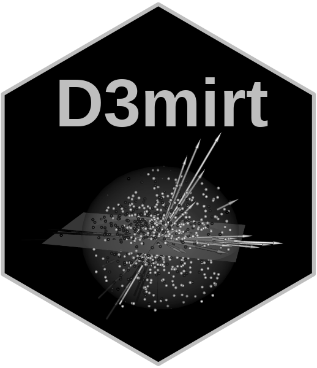
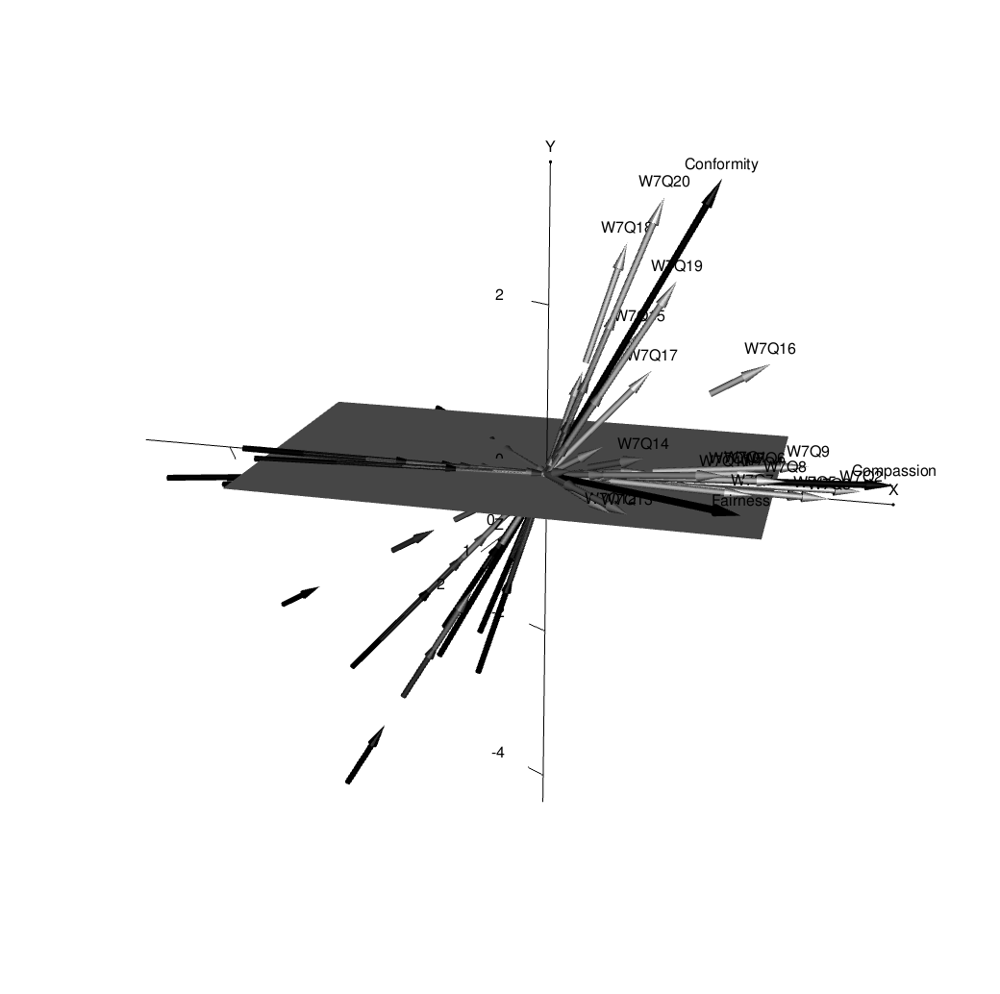
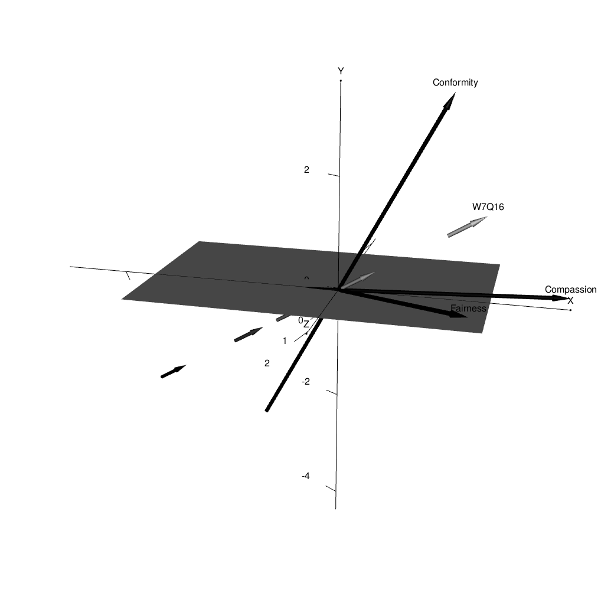
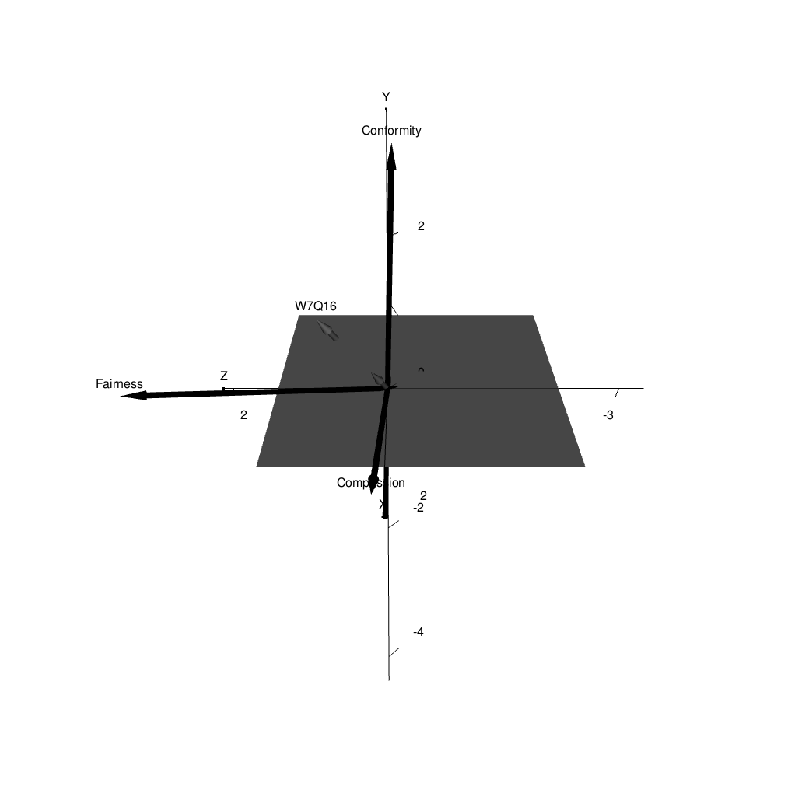
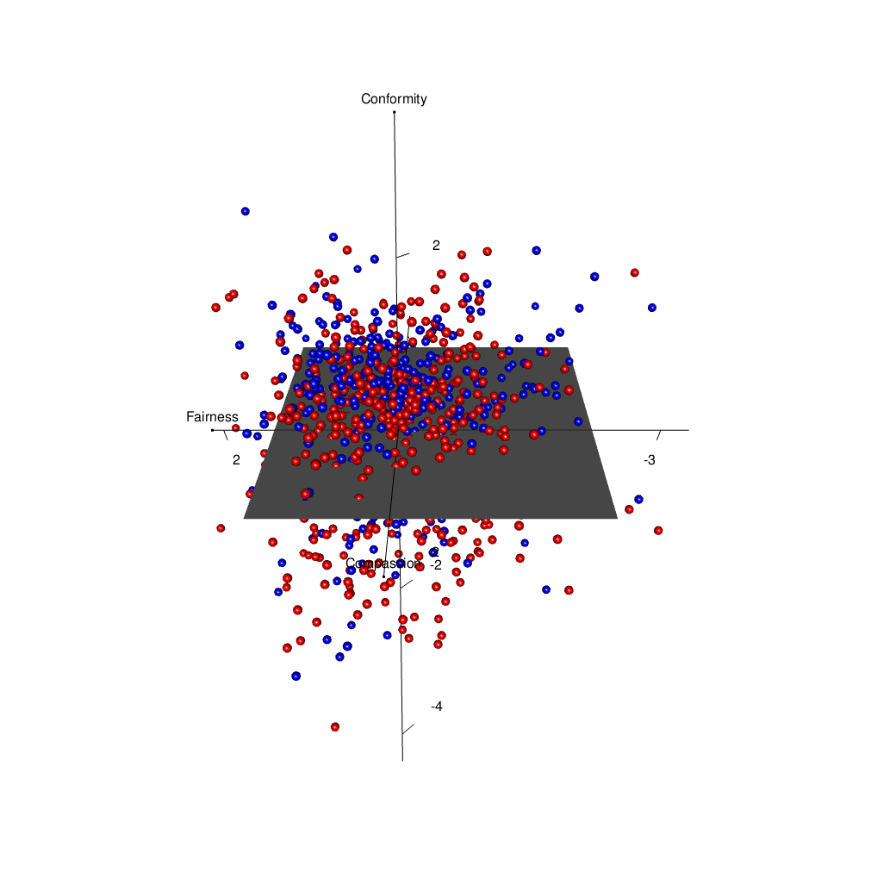
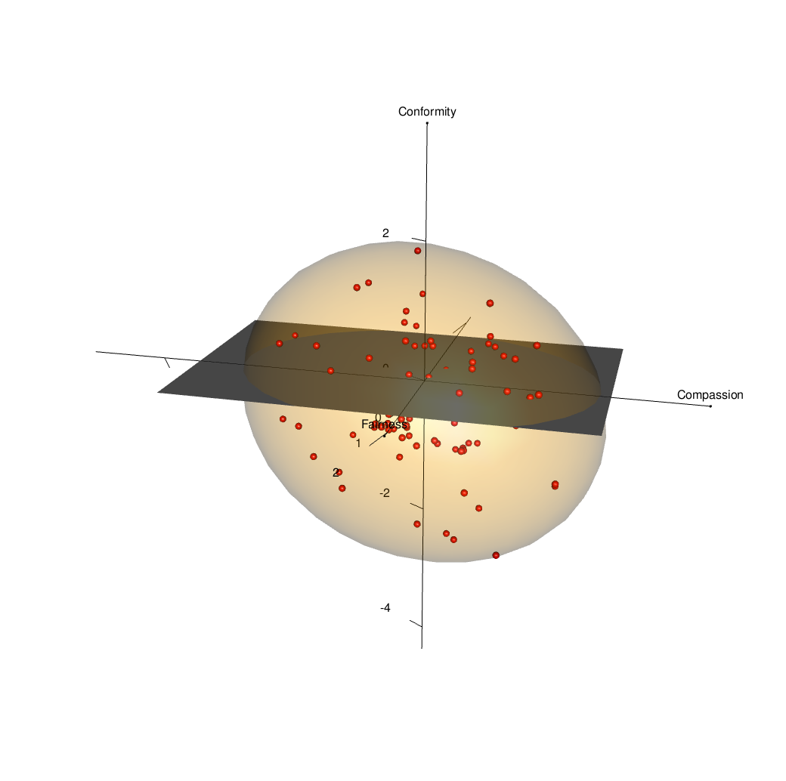
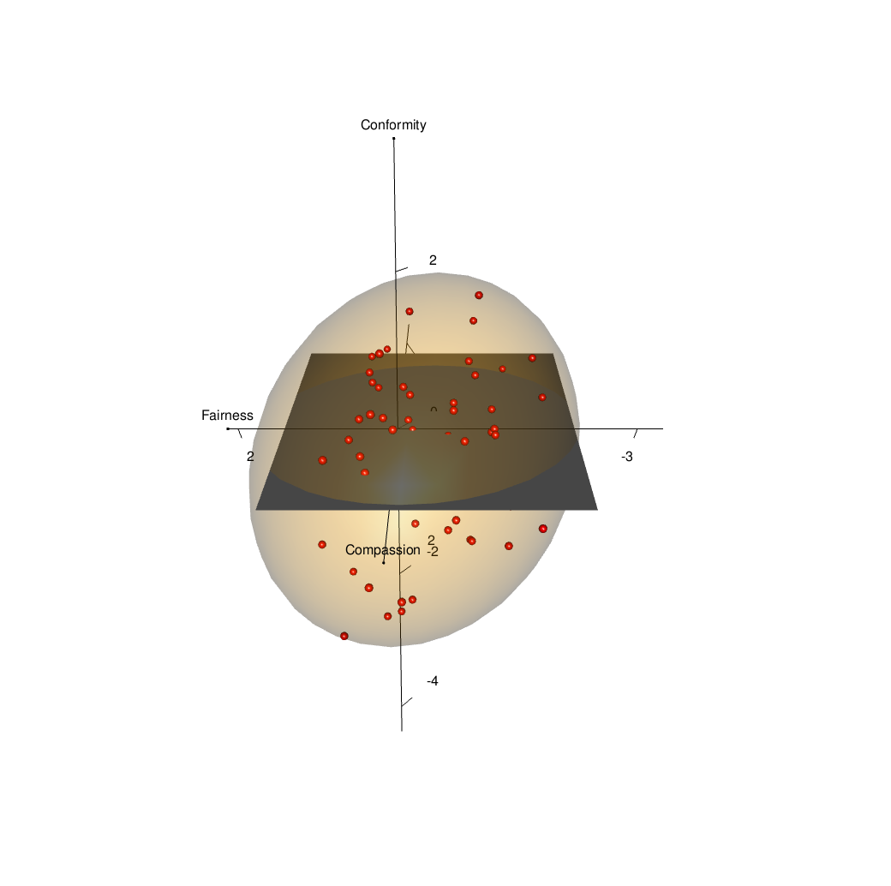

<div align="center">



</div>

# `D3MIRT` Modeling

The `D3mirt` analysis is based on descriptive multidimensional item
response theory (DMIRT; Reckase, 2009, 1985; Reckase & McKinley, 1991)
and can be used to analyze dichotomous and polytomous items (Muraki &
Carlson, 1995) in a three-dimensional ability ($\theta$) space. The
method is foremost visual and illustrates item characteristics with the
help of vector geometry in which items are represented by vector arrows.

In DMIRT analysis, also called within multidimensional modeling, it is
assumed that items in a multidimensional ability space can measure
single or multiple latent traits (Reckase, 2009, 1985; Reckase &
McKinley, 1991). The methodology is a type of data reduction technique
based on the compensatory model (Reckase, 2009), i.e., a type of
measurement model that uses linear combinations of $\theta$-values for
ability assessment. The method seeks to maximize item discrimination and
so is *descriptive* because the results describe the extent to which
items in a test are unidimensional, i.e., that the items discriminate on
one dimension only, or are within-multidimensional, i.e., that the items
discriminate on more than one dimension..

Regarding vector orientation, the angle of the vector arrows indicates
what traits, located along the orthogonal axes in the model, an item can
be said to describe (Reckase, 2009, 1985, Reckase & McKinley, 1991). For
instance, in a two-dimensional space, an item is *unidimensional* if its
item vector arrow is at $0°$ with respect to one of the axes in the
model, and $90°$ with respect to the other. Such an item describes a
singular trait only. In contrast, an item is *within-multidimensional*
if its item vector arrow is oriented at $45°$ in relation to the axes in
the model. Such an item describes both traits in the model equally well.
The same criteria are extended to the three-dimensional case.

The DMIRT approach uses two types of item models, dependent on item
type. If dichotomous items are used, the analysis is based on the
multidimensional two-parameter logistic model (M2PL). If polytomous
items are used, the analysis is based on the multidimensional
two-parameter graded response model (MGRM; Muraki & Carlson, 1995). The
method is therefore limited to items that fit these item models.

The estimation process begins by first fitting and extracting the
discrimination $a$ and difficulty parameters $d$ from a compensatory
model. Next, the DMIRT estimation uses the former to compute the
multidimensional discrimination ($MDISC$) parameter and the
multidimensional difficulty ($MDIFF$) parameter that are used to locate
the items in a vector space.

The $MDIFF$ is interpreted similarly as the difficulty parameter in the
unidimensional model, i.e., it shows the level of ability that is
required for a higher or correct response. Note, if polytomous items are
used, such as Likert items, the items will be represented by multiple
vector arrows (one for each response function). The $MDIFF$ will, in
such a case, show the multidimensional range of difficulty for an item
as located in a multidimensional latent trait space.

The $MDISC$ shows the highest level of discrimination an item can
achieve in the multidimensional model. It is, therefore, a global item
characteristic under the assumption of a multidimensional latent space.
In addition, the $MDISC$ score is visualized in the graphical output by
scaling the length of the vector arrows representing the item response
functions, such that longer arrows indicate higher discrimination (and
vice versa).

A novel theoretical contribution to DMIRT is the use of constructs in
the `D3mirt` functions. Constructs, in this context, refer to the
assumption that a subset of items can measure a higher-order latent
variable. In `D3mirt`, constructs are implemented as optional vectors
whose orientation is calculated as the average direction, i.e., the
average multidimensional discrimination of a subset of items in the
model. A construct vector will, therefore, point in the direction of the
maximum slope of an imaginary item response function indicated by the
items chosen by the user.

If constructs are used, the output will include reporting of the
directional discrimination ($DDISC$) parameter that shows how well the
items discriminate under the assumption that they measure one of the
constructs used in the analysis. That is, while the $MDISC$ represents
the maximum level of discrimination in the model, the $DDISC$ represents
the local discrimination that makes it possible to compare item
discrimination in a specific direction set by the constructs. The
constructs are, therefore, like unidimensional models nested in the
multidimensional latent space and are visually represented with
construct vector arrows scaled to an arbitrary length.

# Overview

The package includes the following functions.

- `modid()`: D3mirt Model Identification
- `D3mirt()`: 3D DMIRT Model Estimation
- `summary()`: Summary Function for `D3mirt()`
- `plotD3mirt`: Graphical Output for `D3mirt()`

## Installation

You can install the `D3mirt` package from CRAN, or try the development
version of the package, by using the following codes for `R`.

``` r
# Install from CRAN depository
install.packages('D3mirt')

# Install development version from Github
# install.packages("devtools")
# To include package vignette in the installation add: build_vignettes = TRUE
devtools::install_github("ForsbergPyschometrics/D3mirt")
```

In what follows, the `D3mirt` procedure will be described very briefly
using the built-in data set “anes0809offwaves”. The data set
($N = 1046, M_{age} = 51.33, SD = 14.56, 57\%$ Female) is a subset from
the American National Election Survey (ANES) from the 2008-2009 Panel
Study Off Wave Questionnaires, December 2009 (DeBell, et al, 2010;
<https://electionstudies.org/data-center/2008-2009-panel-study/>). All
items measure moral preferences and are positively scored of Likert
type, ranging from 1 = *Strongly Disagree* to 6 = *Strongly Agree*.
Demographic variables include age and gender (male/female).

The D3mirt approach largely consists of the following three steps:

1.  Model Identification
2.  D3mirt model estimation
3.  Plotting

For more details on the `D3mirt` package, including extended examples of
analysis and functions, please see the vignette included in the package
documentation.

# 1. Model Identification

As a first step in the analysis, the three-dimensional compensatory
model must be identified (Reckase, 2009). In the three-dimensional case,
this implies locating the $x$ and $y$-axis by selecting two items from
the item set. The first item should not load on the second and third
axes ($y$ and $z$), while the second item should not load on the third
axis ($z$).

If the model is not known beforehand it is necessary to explore the data
with exploratory factor analysis (EFA), preferably with the help of the
EFA option in `mirt::mirt` (Chalmers, 2012), using `ìtemtype = 'graded'`
or `'2PL'`. Note, the EFA is only used to find model identification
items that meet the necessary DMIRT model specification requirements.
The EFA model itself is discarded after this step in the procedure. This
implies that rotation method is less crucial and the user is encouraged
to try different rotation methods and compare the results.

Note, all outputs from functions from the `mirt` package are available
as ready made package files that can be loaded directly into the R
session.

``` r
# Load data
data("anes0809offwaves")
x <- anes0809offwaves
x <- x[,3:22] # Remove columns for age and gender

# Fit a three-factor EFA model with the mirt package
e <- mirt::mirt(x, 3, itemtype = 'graded')

# Assign data frame with factor loadings with oblimin rotation
f <- summary(e, rotate= 'oblimin')
h <- data.frame(f$rotF)
```

``` r
# Optional: Load the EFA data directly from the package file
load("vignettes/efa.Rdata")
```

The `modid()` takes in the factor solution from the EFA, assigned to a
data frame $h$, and outputs an $S3$ object of class `modid` containing
lists with data frames of estimates. The functions have two arguments
that set what is called the *lower* and *upper* bound. In brief, the
lower bound increase the item pool used in the analysis while the upper
bound is a filter that removes improper items that do not meet the
necessary statistical requirements. In other words, the upper bound
should not, in general, be manipulated.

The most important output from the `modid()` function is the item lists,
(denoted `$id`), containing data frames that present suggestions on what
items (`item.1`…`item.n`) to use for the model identification. The data
frames have one column for the loadings from each item on the factor of
interest, and one column with absolute sum scores (denoted `ABS`) for
each item calculated from the remaining factor loadings in the model.
Each item list is sorted with the lowest absolute sum score highest up.
Consequently, the top items in each list are the items that best meet
the necessary statistical requirements for model identification.
Therefore, for a three-dimensional model, all else equal, the item
highest up in the first list should be used to identify the $x$-axis,
and the item highest up in the second list should be used to identify
the $y$-axis, and so on.

``` r
# Call to modid()
modid(h)
#> $id
#> $id[[1]]
#>         Item.1        ABS
#> W7Q3 0.8490903 0.01267429
#> W7Q5 0.8068828 0.04904288
#> W7Q1 0.7543773 0.07203403
#> W7Q2 0.8727652 0.09042323
#> 
#> $id[[2]]
#>          Item.2         ABS
#> W7Q20 0.7858844 0.000653665
#> W7Q18 0.6812006 0.080729410
#> 
#> 
#> $ss.loadings
#>       F1       F3       F2 
#> 5.328901 2.113441 1.689176 
#> 
#> $loadings
#>                F1           F3           F2
#> W7Q11  0.21764339  0.101650054  0.535617304
#> W7Q12  0.07445495 -0.079798063  0.554858770
#> W7Q13 -0.01369236 -0.018393288  0.769725868
#> W7Q14 -0.03993821  0.145349221  0.564359537
#> W7Q15  0.10245563  0.453634967 -0.099027661
#> W7Q16  0.16609422  0.212788638  0.126237569
#> W7Q17  0.21251128  0.576133340  0.039833393
#> W7Q18 -0.05188854  0.681200616 -0.080729410
#> W7Q19  0.02592854  0.626381734  0.125087323
#> W7Q20 -0.05079509  0.785884397  0.000653665
#> W7Q1   0.75437734  0.040367304 -0.031666723
#> W7Q2   0.87276522 -0.024432875 -0.065990357
#> W7Q3   0.84909025 -0.010993866  0.001680422
#> W7Q4   0.66228706  0.032788311  0.101713685
#> W7Q5   0.80688278 -0.040279704 -0.008763174
#> W7Q6   0.66856685  0.054813498  0.102271288
#> W7Q7   0.56078396 -0.013762611  0.211076266
#> W7Q8   0.56779935  0.042979814  0.204500105
#> W7Q9   0.60483387  0.090013632  0.088259630
#> W7Q10  0.77064478  0.009554713 -0.116375618
#> 
#> attr(,"class")
#> [1] "modid"
```

As can be seen, the first item, that will be used to identify the
$x$-axis, is found in the first list, `id[[1]]` and `item.1`. In this
case, the best item for the $x$-axis is item “W7Q3”. The item that
identifies the $y$-axis is found in the next list, `id[[2]]` and
`Item.2`. In this case, the best item for the $y$-axis is item “W7Q20”.

The `modid()` is designed so that the strongest loading item, from the
strongest factor, always aligns perfectly with the x-axis, and the
remaining items follow thereafter. This helps makes the result maximally
interpretable while also avoiding, with the help of the upper bound,
imposing an unempirical structure on the data. If problems appear with
the model identification, please see the package vignette for guidance.

# 2. D3mirt Model Estimation

The `D3mirt()` function takes in a data frame with model parameters from
a three-dimensional compensatory model and returns an $S3$ object of
class `D3mirt` with lists of $a$ and $d$, $MDISC$, and $MDIFF$
parameters, direction cosines, and spherical coordinates. Regarding the
latter, spherical coordinates are represented by $\theta$ and $\phi$.
The $\theta$ coordinate is the positive or negative angle in degrees,
starting from the $x$-axis, of the vector projections from the vector
arrows in the $xz$-plane up to $\pm 180°$. Note, the $\theta$ angle is
oriented following the positive pole of the $x$ and $z$ axis so that the
angle increases clockwise in the graphical output. The $\phi$ coordinate
is the positive angle in degrees from the $y$-axis and the vectors.
Note, the $\rho$ coordinate from the spherical coordinate system is in
DMIRT represented by the MDIFF, and so is reported separately.

If constructs are used, the function also returns construct direction
cosines, spherical coordinates for the construct vector arrows, and
$DDISC$ parameters (one index per construct).

The three-dimensional compensatory model is specified so that all items
load on all three factors in the model, and that the factors are
constrained to be orthogonal (see below). The fitting of the model is
preferably done with the `mirt::mirt` (Chalmers, 2012) function. Please
note very carefully regarding the model specification in the example
below.

``` r
# Load data
data("anes0809offwaves")
x <- anes0809offwaves
x <- x[,3:22] # Remove columns for age and gender

# Fit a three-dimensional graded response model with orthogonal factors
# Example below uses Likert items from the built-in data set "anes0809offwaves"
# Item W7Q3 and item W7Q20 was selected with `modid()`
# The model specification set all items in the data set (1-20) 
# to load on all three factors (F1-F3)
# The START and FIXED commands are used on the two items to identify the DMIRT model
 spec <- ' F1 = 1-20
           F2 = 1-20
           F3 = 1-20

           START=(W7Q3,a2,0)
           START=(W7Q3,a3,0)

           START=(W7Q20,a3,0)

           FIXED=(W7Q3,a2)
           FIXED=(W7Q3,a3)

           FIXED=(W7Q20,a3) '


mod1 <- mirt::mirt(x, 
                   spec, 
                   itemtype = 'graded', 
                   SE = TRUE, 
                   method = 'QMCEM')
 
# Assign a data frame with factor loadings (located in the first three columns in mod1),
# and difficulty parameters (columns 4-8 in mod1) with mirt::coef and $'items'[,1:8]))
d <- data.frame(mirt::coef(mod1, 
                           simplify=TRUE)$'items'[,1:8])
```

``` r
# Optional: Load data frame d directly from the package file
load("vignettes/d.rdata")
```

Constructs can be included in the analysis by creating one or more
nested lists that indicate what items belong to what construct. From
this, the `D3mirt()` function finds the average direction of the subset
of items contained in each construct list by adding and normalizing the
direction cosines for the items and scaling the construct direction
vector to an arbitrary length (length can be user adjusted) so that the
the arrows can be seen when plotting.

The construct vector arrows can contribute to the analysis by (a)
visualizing the average direction for a subset set of items, and (b)
showing how all items discriminate locally in the direction of the
construct vector with the help of the $DDISC$ index.

The `D3mirt()` function call is straightforward. The output, however, is
lengthy so the use of the summary function when inspecting the results
is recommended. The constructs included below were grouped based on
exploratory reasons, i.e., because these items cluster in the model
(will be observable in the graphical output).

``` r
# Call to D3mirt(), including optional nested lists for three constructs
# Item W7Q16 is not included in any construct because of model violations
# The model violations for the item can be seen when plotting the model
c <- list(list (1,2,3,4), 
          list(5,7,8,9,10), 
          list(11,12,13,14,15,15,16,17,18,19,20))
g <- D3mirt(d, c)
summary(g)
#> 
#> 3Dmirt object with 20 items and 5 levels of difficulty
#> 
#> Construct vector 1 contains items 1, 2, 3, 4 
#> 
#> Construct vector 2 contains items 5, 7, 8, 9, 10 
#> 
#> Construct vector 3 contains items 11, 12, 13, 14, 15, 15, 16, 17, 18, 19, 20
#> $model.est
#>           a1      a2      a3      d1     d2     d3      d4      d5
#> W7Q11 1.4237  0.4675  1.0439  6.2189 4.6926 3.5435  1.1920 -1.8576
#> W7Q12 0.7604  0.0410  0.9367  4.1360 2.8771 2.3419  1.1790 -0.4240
#> W7Q13 1.1278  0.2911  1.6930  5.8892 4.3988 3.4413  1.8946 -0.6008
#> W7Q14 0.7447  0.4829  0.9785  5.3891 3.9333 3.0258  0.8143 -1.5868
#> W7Q15 0.4551  0.7870 -0.1606  4.3207 3.0545 2.3969  0.9187 -0.9705
#> W7Q16 0.6237  0.4140  0.1798  3.7249 2.0305 1.1658 -0.0612 -1.8085
#> W7Q17 1.1892  1.3412  0.0563  6.9013 5.8023 4.9345  2.7916 -0.0041
#> W7Q18 0.4106  1.3542 -0.1369  3.7837 2.0985 1.4183  0.1828 -1.9855
#> W7Q19 0.8580  1.4099  0.2279  4.4978 2.6483 1.6730  0.3741 -1.9966
#> W7Q20 0.7357  1.9067  0.0000  4.6378 2.3633 1.2791 -0.3431 -2.9190
#> W7Q1  2.0298  0.1643 -0.1231  8.0865 7.0640 5.9876  3.2015 -0.4835
#> W7Q2  2.6215 -0.0027 -0.2582  9.2885 6.6187 4.5102  1.6649 -2.4439
#> W7Q3  2.7923  0.0000  0.0000 10.4894 7.5887 5.6776  2.7172 -1.1789
#> W7Q4  1.9045  0.1875  0.1495  7.3750 6.0465 4.9813  2.4830 -1.1145
#> W7Q5  2.2425 -0.0287 -0.0839  8.4279 6.6712 4.9049  1.8253 -1.8316
#> W7Q6  2.0021  0.2390  0.1571  8.0684 6.3577 4.9520  2.3300 -1.0189
#> W7Q7  1.6286  0.1034  0.3595  6.0178 4.8974 3.6908  1.6326 -1.3484
#> W7Q8  1.7774  0.2252  0.3531  6.9171 5.1822 3.7661  1.4844 -1.8332
#> W7Q9  1.7198  0.2494  0.1281  7.5586 4.9755 3.3648  0.9343 -2.2094
#> W7Q10 1.7696  0.1272 -0.1406  8.3638 5.7397 4.2863  1.9647 -0.6642
#> 
#> $dmirt.est
#>        MDISC  MDIFF1  MDIFF2  MDIFF3  MDIFF4 MDIFF5
#> W7Q11 1.8263 -3.4052 -2.5695 -1.9403 -0.6527 1.0171
#> W7Q12 1.2072 -3.4262 -2.3833 -1.9400 -0.9767 0.3512
#> W7Q13 2.0550 -2.8658 -2.1405 -1.6746 -0.9220 0.2923
#> W7Q14 1.3211 -4.0793 -2.9773 -2.2904 -0.6164 1.2011
#> W7Q15 0.9232 -4.6801 -3.3085 -2.5963 -0.9951 1.0512
#> W7Q16 0.7699 -4.8382 -2.6374 -1.5142  0.0795 2.3490
#> W7Q17 1.7934 -3.8481 -3.2353 -2.7514 -1.5566 0.0023
#> W7Q18 1.4217 -2.6613 -1.4760 -0.9976 -0.1286 1.3966
#> W7Q19 1.6661 -2.6996 -1.5896 -1.0042 -0.2245 1.1984
#> W7Q20 2.0437 -2.2693 -1.1564 -0.6259  0.1679 1.4283
#> W7Q1  2.0402 -3.9637 -3.4625 -2.9348 -1.5692 0.2370
#> W7Q2  2.6342 -3.5261 -2.5126 -1.7122 -0.6320 0.9278
#> W7Q3  2.7923 -3.7565 -2.7177 -2.0333 -0.9731 0.4222
#> W7Q4  1.9195 -3.8421 -3.1500 -2.5950 -1.2935 0.5806
#> W7Q5  2.2442 -3.7554 -2.9726 -2.1856 -0.8133 0.8161
#> W7Q6  2.0225 -3.9894 -3.1436 -2.4485 -1.1521 0.5038
#> W7Q7  1.6710 -3.6013 -2.9308 -2.2087 -0.9770 0.8069
#> W7Q8  1.8261 -3.7880 -2.8379 -2.0624 -0.8129 1.0039
#> W7Q9  1.7425 -4.3377 -2.8553 -1.9310 -0.5362 1.2679
#> W7Q10 1.7798 -4.6994 -3.2250 -2.4083 -1.1039 0.3732
#> 
#> $dmirt.angles
#>       D.Cos X D.Cos Y D.Cos Z    Theta     Phi
#> W7Q11  0.7796  0.2560  0.5716  36.2490 75.1671
#> W7Q12  0.6299  0.0340  0.7759  50.9315 88.0517
#> W7Q13  0.5488  0.1417  0.8238  56.3293 81.8559
#> W7Q14  0.5637  0.3656  0.7407  52.7295 68.5585
#> W7Q15  0.4929  0.8525 -0.1739 -19.4363 31.5157
#> W7Q16  0.8101  0.5377  0.2336  16.0827 57.4726
#> W7Q17  0.6631  0.7479  0.0314   2.7110 41.5948
#> W7Q18  0.2888  0.9525 -0.0963 -18.4366 17.7258
#> W7Q19  0.5150  0.8462  0.1368  14.8745 32.1959
#> W7Q20  0.3600  0.9330  0.0000   0.0000 21.0985
#> W7Q1   0.9949  0.0806 -0.0603  -3.4700 85.3796
#> W7Q2   0.9952 -0.0010 -0.0980  -5.6253 90.0588
#> W7Q3   1.0000  0.0000  0.0000   0.0000 90.0000
#> W7Q4   0.9922  0.0977  0.0779   4.4875 84.3945
#> W7Q5   0.9992 -0.0128 -0.0374  -2.1436 90.7317
#> W7Q6   0.9899  0.1182  0.0777   4.4863 83.2121
#> W7Q7   0.9746  0.0619  0.2152  12.4486 86.4516
#> W7Q8   0.9733  0.1233  0.1933  11.2350 82.9150
#> W7Q9   0.9870  0.1431  0.0735   4.2594 81.7720
#> W7Q10  0.9943  0.0715 -0.0790  -4.5437 85.9000
#> 
#> $construct.angles
#>    C.Cos X C.Cos Y C.Cos Z   Theta     Phi
#> C1  0.6411  0.2026  0.7402 49.1064 78.3081
#> C2  0.4720  0.8814 -0.0208 -2.5190 28.1921
#> C3  0.9977  0.0613  0.0298  1.7098 86.4857
#> 
#> $ddisc
#>       DDISC1 DDISC2 DDISC3
#> W7Q11 1.7802 1.0624 1.4802
#> W7Q12 1.1892 0.3756 0.7890
#> W7Q13 2.0353 0.7537 1.1935
#> W7Q14 1.2996 0.7568 0.8017
#> W7Q15 0.3324 0.9118 0.4975
#> W7Q16 0.6169 0.6555 0.6530
#> W7Q17 1.0759 1.7422 1.2704
#> W7Q18 0.4364 1.3902 0.4886
#> W7Q19 1.0044 1.6428 0.9492
#> W7Q20 0.8580 2.0277 0.8509
#> W7Q1  1.2434 1.1054 2.0315
#> W7Q2  1.4889 1.2403 2.6076
#> W7Q3  1.7901 1.3179 2.7858
#> W7Q4  1.3696 1.0610 1.9160
#> W7Q5  1.3697 1.0349 2.2330
#> W7Q6  1.4482 1.1524 2.0168
#> W7Q7  1.3311 0.8523 1.6418
#> W7Q8  1.4464 1.0301 1.7976
#> W7Q9  1.2479 1.0288 1.7349
#> W7Q10 1.0561 0.9503 1.7691
```

# 3. Plotting

## The `plotD3mirt` Function

The `plotD3mirt` function is built on the `rgl` package (Adler &
Murdoch, 2023) for visualization with OpenGL. Graphing in default mode
by calling `plotd3mirt` will return an RGL device that will appear in an
external window as a three-dimensional interactive object, containing
vector arrows with the latent dimensions running along the orthogonal
axes, that can be rotated. In this illustration, however, all RGL
devices are plotted inline as still shots from two angles, $15^{\circ}$
(clockwise; default plot angle) and $90^{\circ}$. To change the plot
output to $90^{\circ}$, use the `view` argument in the `plotD3mirt`
function and change the first indicator from $15$ to $90$.

``` r
# Plot RGL device with constructs visible and named
plotD3mirt(g, 
           constructs = TRUE, 
           construct.lab = c("Fairness", "Conformity", "Compassion"))
```

Figure 1: Three-dimensional vector
plot for all items and the three constructs Compassion, Conformity, and
Fairness (solid black arrows) plotted rotated $15^{\circ}$ clock wise.

Figure 2: Three-dimensional vector
plot for all items and the three constructs Compassion, Conformity, and
Fairness (solid black arrows) plotted rotated $90^{\circ}$ clock wise.

An example of how the output can be described could be as follows.

> As can be seen in Figures 1 and 2, the pattern in the data indicates
> the presence of foremost two main nested latent constructs indicated
> by the items, one aligned with the $x$-axis and one approaching the
> $y$-axis. We might also suspect the presence of a third construct
> located close to the $xy$-plane, between the $x$ and $z$ axes.
> Studying the content of the items, the labels *Compassion*,
> *Conformity*, and *Fairness* were introduced. The angles of the
> constructs inform us that Compassion ($\theta = 1.710^{\circ}$,
> $\phi = 86.486^{\circ}$) and Conformity
> ($\theta = - 2.519^{\circ}$,$\phi = 28.192^{\circ}$) have some
> within-multidimensional tendencies. However, they are both more or
> less orthogonal to the $z$-axis ($\theta = 1.710^{\circ}$ and
> $\theta = -2.519^{\circ}$ respectively). Next, we find Fairness
> ($\theta = 49.106^{\circ}$, $\phi = 78.308^{\circ}$) with clear
> within-multidimensional tendencies with respect to the $x$-axis. Thus,
> the output indicates that Compassion and Conformity could be
> independent constructs but that Fairness seems not to be.

As was mentioned above, the W7Q16 was not included in any of the
constructs because the item had measurement problems. For example, the
short vector arrows indicate high amounts of model violations. Moreover,
the location of the item in the model also indicates that the item is
within-multidimensional and that it does not seem to belong to any
construct explicitly.

The `plotD3mirt()` function allows plotting W7Q16 in isolation using the
argument `items` and by entering the number indicating where the item
appears in the data set (see `?anes0809offwaves`).

``` r
# Item W7Q16 has location 6 in the data set (gender and age excluded)
# The item is plotted together with construct to aid the visual interpretation
plotD3mirt(g, 
           constructs = TRUE, 
           items = 6, 
           construct.lab = c("Fairness", "Conformity", "Compassion"))
```

Figure 3: The item W7Q16 plotted with
the three constructs, with the model rotated $15^{\circ}$ clock wise.
Figure 4: The item W7Q16 plotted with
the three constructs, with the model rotated $90^{\circ}$ clock wise.

An example of how the output can be described could be as follows.

> The Figures 3 and 4 shows that item W7Q16 is located at
> $\theta = 16.083^{\circ}$, $\phi = 57.473^{\circ}$, indicating that
> the item is within-multidimensional with respect to the $x$ and
> $y$-axis; but much less so with respect to the $z$-axis. In addition,
> the directional discrimination further underscores that the item does
> not seem to measure any particular construct ($DDISC_1 = .656$,
> $DDISC_2 = .656$, $DDISC_3 = .617$). The global discrimination
> ($MDISC = .770$, $MDIFF_{range} = [-4.838, 2.349]$) is also the lowest
> of all discrimination scores in the model. This, combined, implies
> that the item in question does not seem to fit the three-dimensional
> DMIRT model used in this analysis and should therefore be removed or
> adapted. On a side note, we can also note that item W7Q15,
> $MDISC = .923$, $MDIFF_{range} = [-4.680, 1.051]$) has the second
> lowest global discrimination score. However, this item does seem to
> belong to the Conformity construct, observable when comparing angle
> orientation ($\theta = -19.436^{\circ}, \phi = 31.516^{\circ}$) and
> discrimination ($MDISC = .923$, $DDISC_1 = .332$, $DDISC_2 = .912$,
> $DDISC_3 = .497$).

## `D3mirt` Profile Analysis

The `plotD3mirt()` function can also display respondents in the
three-dimensional model represented as spheres located using respondent
factors scores used as coordinates. This allows for a profile analysis
in which respondents can be separated, or subset, conditioned on single
or multiple criteria and then plotted. The resulting output shows where
the respondents are located in the model, and, accordingly, what model
profile best describes them. Similarly, respondent categories can be
simultaneously compared to see if a group-level effect can be visually
observed.

To do this, the user must first extract respondent factor scores with
`mirt::fscores` (Chalmers, 2012) and then separate or select a subset of
respondent rows based on one or more criteria. The resulting data frame
is imputed in the `profiles` argument. Generally, it can be useful to
hide vector arrows with `hide = TRUE` when plotting respondent profiles
to avoid visual cluttering. The example below separates respondents
using the gender variable included in the built-in data set.

``` r
# Extract respondent factor scores from mod1 with fscores() function from [mirt::mirt]
f <- mirt::fscores(mod1, 
                   method="EAP", 
                   full.scores = TRUE, 
                   full.scores.SE = FALSE, QMC = TRUE)
```

``` r
# Optional: Load the respondent factor scores directly from the package file
load("vignettes/fscores.Rdata")
```

``` r
# Attach f to the gender variable (column 2 from anes0809offwaves data set; "W3XGENDER")
# Use cbind with fscores() output attached first
data("anes0809offwaves")
x <- anes0809offwaves
z <- data.frame(cbind(f, x[,2]))
```

The `plotD3mirt` function uses `as.factor()` to count the number of
factor levels in the data imputed in the `levels` argument. This means
that raw data can be used as is but the number of colors in the color
vectors argument (`sphere.col`) may need to be adapted. In the example
below, the criteria variable for gender only hold two factor levels and
therefore only two colors in the color vector are needed.

Call `plotD3mirt` with the respondent data frame $z$ in the `profiles`
argument and the `levels` argument with the levels column subset from
$z$. In the function call below, the axes in the model are named using
the `x.lab`, `y.lab`, and `z.lab` arguments following the direction of
the constructs. Note, the model axes represent unidimensional singular
structures, or traits, in this case borrowing the names of the
constructs.

``` r
# Plot profiles with item vector arrows hidden with hide = TRUE
# Score levels: 1 = Blue ("male") and 2 = Red ("female")
plotD3mirt(g, hide = TRUE, 
           profiles = z, 
           levels = z[,4], 
           sphere.col = c("blue", "red"), 
           x.lab = "Compassion", 
           y.lab="Conformity", 
           z.lab="Fairness")
```

Figure 5: Gender profile for the
`anes0809offwaves` data set, plotted rotated $15^{\circ}$ clock wise.

Figure 6: Gender profile for the
`anes0809offwaves` data set, plotted rotated $90^{\circ}$ clock wise.

An example of how the output can be described could be as follows.

> In Figures 5 and 6, it can be observed a simple profile on gender in
> which more women tend to have higher levels of trait Compassion. When
> rotating the model $90^{\circ}$ clockwise, there seems not to be any
> easily observable gender difference related to trait Conformity or
> trait Fairness.

### Plotting Confidence Intervals

It is also possible to plot a confidence interval in the shape of an
ellipse surrounding the individual factor scores. In the example below,
the younger individuals ($\leq30$) are selected and plotted together
with a $95\%$ *CI*.

``` r
# Column bind fscores() with age variable ("W3Xage") from column 1
y <- data.frame(cbind(f, x[,1]))

# Subset data frame y conditioned on age <= 30
z1 <- subset(y, y[,4] <= 30)
```

When a criterion variable has a wide data range, such as an age
variable, `rep()` can be used to set the appropriate size of the color
vector for `sphere.col` by repeating color names with `rep()`. When
plotting,the `plotD3mirt()` function will pick colors from the
`sphere.col` argument following the factor order in the levels argument.
To do this, the first step is to count the number of factors in the
criterion variable. This can be done with `nlevels()`, as can be seen
below.

``` r
# Check number of factor levels with nlevels() and as.factor()
nlevels(as.factor(z1[,4]))
#> [1] 14

# Use rep() to create a color vector to color groups based on the nlevels() output
# z1 has 14 factor levels
colvec <- c(rep("red", 14))
```

To plot the *CI*, the `ci` argument is set to `TRUE`. The color of the
sphere was also changed from default `grey80` to `orange` in the example
below. Note, the *CI* limit can be adjusted with the `ci.level`
argument.

``` r
# Call plotD3mirt with profile data on age with item vector arrows hidden
plotD3mirt(g, hide = TRUE, 
           profiles = z1, 
           levels = z1[,4], 
           sphere.col = colvec, 
           x.lab = "Compassion", 
           y.lab="Conformity", 
           z.lab="Fairness", 
           ci = TRUE, 
           ci.level = 0.95, 
           ellipse.col = "orange")
```

Figure 7: Adults less than or equal to
age 30 from the `anes0809offwaves` data set plotted surrounded by a
$95\%\,CI$ and rotated $15^{\circ}$ clock wise.

Figure 8: Adults less than or equal to
age 30 from the `anes0809offwaves` data set plotted surrounded by a
$95\%\,CI$ and rotated $90^{\circ}$ clock wise.

An example of how the output can be described could be as follows.

> In Figures 7 and 8 we can see a tendency for a profile on age in which
> younger individuals could be described as less oriented towards trait
> Conformity. We can also observe a tendency for what could be an
> interaction effect in which higher levels of trait Conformity seem to
> be associated with lower levels of trait Fairness.

# Exporting The RGL Device

Some options for exporting the RGL device are shown below. Over and
above these, it is also possible to export graphical devices in R
Markdown documents with `rgl::hookwebgl()` together with graphical
options for knitr, as was done when creating this vignette.

``` r
# Export an open RGL device to the console that can be saved as a html or image file
plotD3mirt(g, 
           constructs = TRUE)
s <- scene3d()
rgl::rglwidget(s, 
               width = 1040, 
               height = 1040)

# Export a snap shoot of an open RGL device directly to file
plotD3mirt(g, 
           constructs = TRUE)
rgl::rgl.snapshot('RGLdevice.png', 
                    fmt = 'png')
```

# Getting Help and Reporting Bugs

If you encounter a bug, please file an issue with a minimal reproducible
example on GitHub (<https://github.com/ForsbergPyschometrics/D3mirt>).
For questions please contact me on Github or via email
(<forsbergpsychometrics@gmail.com>).

# References

Adler, D., & Murdoch, D. (2023). *Rgl: 3d Visualization Using OpenGL*
\[Computer software\]. <https://dmurdoch.github.io/rgl/index.html>

Chalmers, R., P. (2012). mirt: A Multidimensional Item Response Theory
Package for the R Environment. *Journal of Statistical Software, 48*(6),
1-29. <https://doi.org/10.18637/jss.v048.i06>

DeBell, M., Krosnick, J. A., & Lupia, A.(2010). *Methodology Report and
User’s Guide for the 2008-2009 ANES Panel Study*. Palo Alto, CA, and Ann
Arbor, MI: Stanford University and the University of Michigan.

Muraki, E., & Carlson, J. E. (1995). Full-Information Factor Analysis
for Polytomous Item Responses. *Applied Psychological Measurement,
19*(1), 73-90. <https://doi.org/10.1177/014662169501900109>

Reckase, M. D.(2009).*Multidimensional Item Response Theory*. Springer.
<https://doi.org/10.1007/978-0-387-89976-3>

Reckase, M. D.(1985). The Difficulty of Test Items That Measure More
Than One Ability. *Applied Psychological Measurement, 9*(4),401-412.
<https://doi.org/10.1177/014662168500900409>

Reckase, M. D., & McKinley, R. L. (1991). The Discriminating Power of
Items That Measure More Than One Dimension. *Applied Psychological
Measurement, 15*(4), 361-373.
<https://doi.org/10.1177/014662169101500407>
