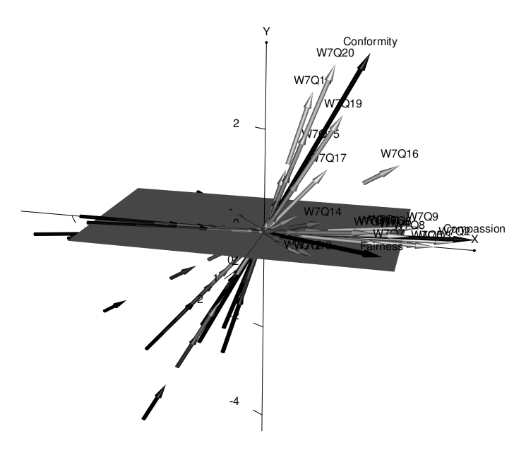
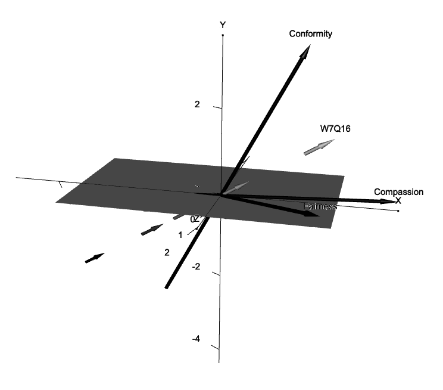
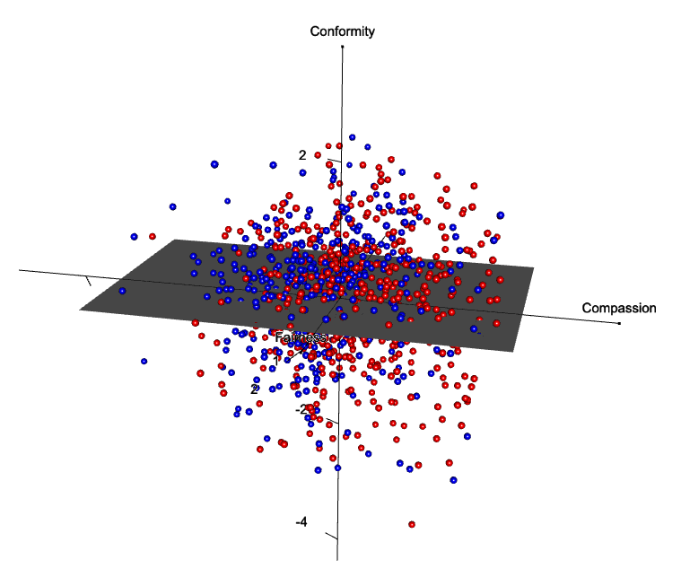

# `D3MIRT` Modeling

The `D3mirt` analysis is based on descriptive multidimensional item
response theory (DMIRT; Reckase2009, 1985; Reckase & McKinley, 1991) and
can be used to analyze dichotomous and polytomous items in a
multidimensional ability space. In DMIRT analysis, also called within
multidimensional modeling, it is assumed that items in a
multidimensional ability space can measure single or multiple latent
traits (Reckase, 2009, 1985; Reckase & McKinley, 1991). The method is
said to be descriptive because the estimates describe item
characteristics when more than one latent dimension is used in the
analysis. The strength of the method is the possibility to represent
item response functions visually with vector arrows located in a
three-dimensional space.

The DMIRT analysis use the two-parameter graded response model (GRM;
Samejima, 1969) to extract multidimensional equivalents to the
discrimination $a$ and difficulty parameters $d$. The former becomes the
multidimensional discrimination ($MDISC$) parameter and the latter the
multidimensional difficulty ($MDIFF$) parameter.

The $MDIFF$ is interpreted similarly as the difficulty parameter in the
unidimensional model, i.e., it describes a multidimensional distance
from the origin to the item response function and shows the level of
ability that is required for a higher response. Likewise, the $MDISC$
represents the highest level of discrimination an item can achieve, but
when located in a multidimensional latent trait space. In addition,
in`D3mirt` the $MDISC$ score is visualized by scaling the length of the
vector arrows representing the item response functions.

# Overview

The package includes the following functions.

- `modid()`: D3mirt Model Identification.
- `D3mirt()`: 3D DMIRT Model Estimation.
- `summary()`: Summary Function for `D3mirt()`.
- `plotD3mirt`: Graphical Output for `D3mirt()`.

## Installation

You can install the development version of D3mirt from
[GitHub](https://github.com/) with:

``` r
# install.packages("devtools")
devtools::install_github("ForsbergPyschometrics/D3mirt")
```

In what follows, the `D3mirt` procedure will be described very briefly
using the built-in data set “anes08_09offwaves”. The data set
($N = 1046, M_{age} = 51.33, SD = 14.56, 57\%$ Female) is a subset from
the American National Election Survey (ANES) from the 2008-2009 Panel
Study Off Wave Questionnaires, December 2009 (DeBell, et al, 2010;
<https://electionstudies.org/data-center/2008-2009-panel-study/>). All
items measure moral preferences and are positively scored of Likert
type, ranging from 1 = *Strongly Disagree* to 6 = *Strongly Agree*.
Demographic variables include age and gender (male/female). For more
details on the `D3mirt` approach, see the vignette included in the
package documentation.

# Model Identification

As a first step in the analysis, the three-dimensional GRM must be
identified (Reckase, 2009). In the three-dimensional case, this implies
locating the x and y-axis.

If the model is not known, this can be done with exploratory factor
analysis (EFA), preferably with the help of the EFA option in
`mirt::mirt` (Chalmers, 2012) using `ìtemtype = 'graded'`. Note, the EFA
model itself is discarded after this step in the procedure.

``` r
# Load data
data("anes08_09offwaves")
x <- anes08_09offwaves
x <- x[,3:22] # Remove columns for age and gender

# Fit a three-factor EFA model with the mirt package
f <- mirt::mirt(x, 3, itemtype = 'graded')

# Assign data frame with factor loadings with oblimin rotation
g <- summary(f, rotate= 'oblimin')
h <- data.frame(g$rotF)
```

The item lists have one column for the loadings from each item on the
factor of interest, and one column with absolute sum scores (denoted
`ABS`) for each item calculated from the remaining factor loadings in
the model. Each item list is sorted with the lowest absolute sum score
highest up.

``` r
# Call to modid()
modid(h)
#> $items
#> $items[[1]]
#>         Item.1        ABS
#> W7Q3 0.8490903 0.01267429
#> W7Q5 0.8068828 0.04904288
#> W7Q1 0.7543773 0.07203403
#> W7Q2 0.8727652 0.09042323
#> 
#> $items[[2]]
#>          Item.2         ABS
#> W7Q20 0.7858844 0.000653665
#> W7Q18 0.6812006 0.080729410
#> 
#> 
#> $ss.loadings
#>       F1       F3       F2 
#> 5.328901 2.113441 1.689176 
#> 
#> $loadings
#>                F1           F3           F2
#> W7Q11  0.21764339  0.101650054  0.535617304
#> W7Q12  0.07445495 -0.079798063  0.554858770
#> W7Q13 -0.01369236 -0.018393288  0.769725868
#> W7Q14 -0.03993821  0.145349221  0.564359537
#> W7Q15  0.10245563  0.453634967 -0.099027661
#> W7Q16  0.16609422  0.212788638  0.126237569
#> W7Q17  0.21251128  0.576133340  0.039833393
#> W7Q18 -0.05188854  0.681200616 -0.080729410
#> W7Q19  0.02592854  0.626381734  0.125087323
#> W7Q20 -0.05079509  0.785884397  0.000653665
#> W7Q1   0.75437734  0.040367304 -0.031666723
#> W7Q2   0.87276522 -0.024432875 -0.065990357
#> W7Q3   0.84909025 -0.010993866  0.001680422
#> W7Q4   0.66228706  0.032788311  0.101713685
#> W7Q5   0.80688278 -0.040279704 -0.008763174
#> W7Q6   0.66856685  0.054813498  0.102271288
#> W7Q7   0.56078396 -0.013762611  0.211076266
#> W7Q8   0.56779935  0.042979814  0.204500105
#> W7Q9   0.60483387  0.090013632  0.088259630
#> W7Q10  0.77064478  0.009554713 -0.116375618
#> 
#> attr(,"class")
#> [1] "modid"
```

The top items in each list should be used to identify the model. The
first item, the top item in `item.1` located in list, will be used set
the x-axis. In this case, the best item for the x-axis is “W7Q3”. The
second item, the top item in `Item.2` in `items[[1]]` will be used to
identify the y-axis. In this case, the best item for the y-axis is
“W7Q20”.

# The `D3mirt()` Function

The `D3mirt()` function takes in a data frame with model parameters from
a three-dimensional GRM model, specified with orthogonal factors, and
set so that all items load on all factors (see examples below). The
three-dimensional GRM estimation is preferably done with the
`mirt::mirt` (Chalmers, 2012) function. Please note very carefully how
the GRM model is specified in the example below.

``` r
# Load data
data("anes08_09offwaves")
x <- anes08_09offwaves
x <- x[,3:22] # Remove columns for age and gender

# Fit a three-dimensional graded response model with orthogonal factors
# Example below uses Likert items from the built-in data set "anes08_09offwaves"
# Item W7Q3 and item W7Q20 was selected with `modid()`
# The model specification specify all items in the data set (1-20) to load on all three factors (F1-F3)
# The START and FIXED commands are used on the two items to identify the DMIRT model
 spec <- ' F1 = 1-20
           F2 = 1-20
           F3 = 1-20

           START=(W7Q3,a2,0)
           START=(W7Q3,a3,0)

           START=(W7Q20,a3,0)

           FIXED=(W7Q3,a2)
           FIXED=(W7Q3,a3)

           FIXED=(W7Q20,a3) '


mod1 <- mirt::mirt(x, 
                   spec, 
                   itemtype = 'graded', 
                   SE = TRUE, 
                   method = 'QMCEM')

# Assign a data frame with factor loadings (located in the first three columns in mod1),
# and difficulty parameters (columns 4-8 in mod1) with mirt::coef and $'items'[,1:8]))
d <- data.frame(mirt::coef(mod1, 
                           simplify=TRUE)$'items'[,1:8])
```

In `D3mirt` modeling, the user has the option of including constructs in
the estimation by creating one or more nested lists that indicate what
items belong to what construct. The construct vector arrows can
contribute to the analysis by (a) visualizing the average direction for
a subset set of items, and (b) showing how combinations of items
interrelate on group-level in the model, i.e., as a type of
dimensionality analysis. Note, the length of the construct vector arrows
is arbitrary.

The `D3mirt()` function call is straightforward. The output, however, is
lengthy so it is recommended to use the summary function when inspecting
the results.

``` r
# Call to D3mirt(), including optional nested lists for three constructs
# Item W7Q16 is not included in any construct because of model violations
# The model violations for the item can be seen when plotting the model
c <- list(list (1,2,3,4), 
          list(5,7,8,9,10), 
          list(11,12,13,14,15,15,16,17,18,19,20))
g <- D3mirt(d, c)
summary(g)
#> 
#> 3Dmirt object with 20 items and 5 levels of difficulty
#> 
#> Construct vector 1 contains items 1, 2, 3, 4 
#> 
#> Construct vector 2 contains items 5, 7, 8, 9, 10 
#> 
#> Construct vector 3 contains items 11, 12, 13, 14, 15, 15, 16, 17, 18, 19, 20
#> $dmirt.est
#>           a1      a2      a3      d1     d2     d3      d4      d5  MDISC
#> W7Q11 1.4237  0.4675  1.0439  6.2189 4.6926 3.5435  1.1920 -1.8576 1.8263
#> W7Q12 0.7604  0.0410  0.9367  4.1360 2.8771 2.3419  1.1790 -0.4240 1.2072
#> W7Q13 1.1278  0.2911  1.6930  5.8892 4.3988 3.4413  1.8946 -0.6008 2.0550
#> W7Q14 0.7447  0.4829  0.9785  5.3891 3.9333 3.0258  0.8143 -1.5868 1.3211
#> W7Q15 0.4551  0.7870 -0.1606  4.3207 3.0545 2.3969  0.9187 -0.9705 0.9232
#> W7Q16 0.6237  0.4140  0.1798  3.7249 2.0305 1.1658 -0.0612 -1.8085 0.7699
#> W7Q17 1.1892  1.3412  0.0563  6.9013 5.8023 4.9345  2.7916 -0.0041 1.7934
#> W7Q18 0.4106  1.3542 -0.1369  3.7837 2.0985 1.4183  0.1828 -1.9855 1.4217
#> W7Q19 0.8580  1.4099  0.2279  4.4978 2.6483 1.6730  0.3741 -1.9966 1.6661
#> W7Q20 0.7357  1.9067  0.0000  4.6378 2.3633 1.2791 -0.3431 -2.9190 2.0437
#> W7Q1  2.0298  0.1643 -0.1231  8.0865 7.0640 5.9876  3.2015 -0.4835 2.0402
#> W7Q2  2.6215 -0.0027 -0.2582  9.2885 6.6187 4.5102  1.6649 -2.4439 2.6342
#> W7Q3  2.7923  0.0000  0.0000 10.4894 7.5887 5.6776  2.7172 -1.1789 2.7923
#> W7Q4  1.9045  0.1875  0.1495  7.3750 6.0465 4.9813  2.4830 -1.1145 1.9195
#> W7Q5  2.2425 -0.0287 -0.0839  8.4279 6.6712 4.9049  1.8253 -1.8316 2.2442
#> W7Q6  2.0021  0.2390  0.1571  8.0684 6.3577 4.9520  2.3300 -1.0189 2.0225
#> W7Q7  1.6286  0.1034  0.3595  6.0178 4.8974 3.6908  1.6326 -1.3484 1.6710
#> W7Q8  1.7774  0.2252  0.3531  6.9171 5.1822 3.7661  1.4844 -1.8332 1.8261
#> W7Q9  1.7198  0.2494  0.1281  7.5586 4.9755 3.3648  0.9343 -2.2094 1.7425
#> W7Q10 1.7696  0.1272 -0.1406  8.3638 5.7397 4.2863  1.9647 -0.6642 1.7798
#> 
#> $dmirt.angles
#>       D.Cos X D.Cos Y D.Cos Z   Deg.X   Deg.Y    Deg.Z
#> W7Q11  0.7796  0.2560  0.5716 38.7777 75.1671  55.1388
#> W7Q12  0.6299  0.0340  0.7759 50.9584 88.0517  39.1093
#> W7Q13  0.5488  0.1417  0.8238 56.7134 81.8559  34.5285
#> W7Q14  0.5637  0.3656  0.7407 55.6902 68.5585  42.2080
#> W7Q15  0.4929  0.8525 -0.1739 60.4658 31.5157 100.0172
#> W7Q16  0.8101  0.5377  0.2336 35.8907 57.4726  76.4927
#> W7Q17  0.6631  0.7479  0.0314 48.4621 41.5948  88.2006
#> W7Q18  0.2888  0.9525 -0.0963 73.2117 17.7258  95.5255
#> W7Q19  0.5150  0.8462  0.1368 59.0051 32.1959  82.1387
#> W7Q20  0.3600  0.9330  0.0000 68.9015 21.0985  90.0000
#> W7Q1   0.9949  0.0806 -0.0603  5.7761 85.3796  93.4587
#> W7Q2   0.9952 -0.0010 -0.0980  5.6256 90.0588  95.6253
#> W7Q3   1.0000  0.0000  0.0000  0.0000 90.0000  90.0000
#> W7Q4   0.9922  0.0977  0.0779  7.1759 84.3945  85.5340
#> W7Q5   0.9992 -0.0128 -0.0374  2.2650 90.7317  92.1434
#> W7Q6   0.9899  0.1182  0.0777  8.1307 83.2121  85.5452
#> W7Q7   0.9746  0.0619  0.2152 12.9368 86.4516  77.5756
#> W7Q8   0.9733  0.1233  0.1933 13.2581 82.9150  78.8518
#> W7Q9   0.9870  0.1431  0.0735  9.2584 81.7720  85.7845
#> W7Q10  0.9943  0.0715 -0.0790  6.1172 85.9000  94.5321
#> 
#> $construct.angles
#>   D.Cos X D.Cos Y D.Cos Z   Deg.X   Deg.Y   Deg.Z
#> 1  0.6411  0.2026  0.7402 50.1281 78.3081 42.2479
#> 2  0.4720  0.8814 -0.0208 61.8375 28.1921 91.1898
#> 3  0.9977  0.0613  0.0298  3.9077 86.4857 88.2934
```

The function then returns an $S3$ object of class `D3mirt` with lists of
$a$ and $d$ parameters from the GRM, as well as $MDISC$, $MDIFF$,
direction cosines, and degrees for vector angles, construct lists, and
vector coordinates assessed by `D3mirt()`.

# The `plotD3mirt` Function

The `plotD3mirt` function is based on the `rgl` package (Adler &
Murdoch, 2023) for visualization with OpenGL. Graphing in default mode
by calling `plotd3mirt` will return an RGL device that will appear in an
external window as a three-dimensional object that can be rotated. In
this illustration, however, all RGL devices are shown inline as
interactive objects.

``` r
# Plot RGL device with constructs visible and named
plotD3mirt(g, 
           constructs = TRUE, 
           construct.lab = c("Fairness", "Conformity", "Compassion"))
```



An example of how the output can be described could be as follows.

> Figure $X$ indicates the presence of foremost two latent dimensions,
> one aligned with the x-axis and one approaching the y-axis. The two
> dimensions, however, have some within-multidimensional tendencies
> since they are not completely orthogonal. This tendency, is much more
> prominent for the items W7Q11, W7Q12, W7Q13, and W7Q14, being located
> at around the $45°$ angle or higher between the x and z-axis.
> Moreover, the angles of the construct vectors inform us of how these
> groups of items are associated. In this example, we find Compassion
> ($x° = 3.91, y° = 86.49, z° = 88.29$) and Conformity
> ($x° = 61.84, y° = 28.19, z° = 91.19$) with some
> within-multidimensional tendencies. However, they are both more or
> less orthogonal to the z-axis. Next, we find Fairness
> ($x° = 50.13, y° = 78.31, z° = 42.25$) with clear
> within-multidimensional tendencies with respect to the x and z-axis.
> Thus, Fairness, in this model, does not seem to be an independent
> construct.

In this model, item W7Q16 had the most measurement problems of all items
in the data. More specifically, the short vector arrows indicate high
amounts of model violations. Moreover, the location of the item in the
model also indicates that the item is within-multidimensional and that
it does not seem to belong to any construct explicitly.

The `plotD3mirt` allows us to plot the item alone using argument `items`
and entering the number indicating where the item appears in the data
set (see `?anes08_09offwaves`).

``` r
# Item W7Q16 has location 6 in the data set (gender and age excluded)
# The item is plotted together with construct to aid the visual interpretation
plotD3mirt(g, 
           constructs = TRUE, 
           items = 6, 
           construct.lab = c("Fairness", "Conformity", "Compassion"), 
           view = c(15, 20, 0.6))
```



An example of how the output can be described could be as follows.

> Figure $X$ shows that item W7Q16 is located at
> $x° = 35.89, y° = 57.47, z° = 76.49$ which indicates that it is
> within-multidimensional with respect to the x and y-axis and can also
> be seen to be oriented between the constructs Compassion and
> Conformity. The discrimination score
> ($MDISC = .7699, MDIFF_{range} = [3.72, -1.81]$) is the lowest of all
> discrimination scores for the items in the model. This implies that
> the item in question does not seem to fit the three-dimensional GRM
> used in this particular analysis. We should also note that item W7Q15
> ($x° = 60.47, y° = 31.52, z° = 100.02, MDISC = .9232,MDIFF_{range} = [4.32, -.97]$)
> has the second lowest discrimination score. However, the latter item
> do seem to belong to the Conformity construct when comparing angle
> orientation in the model.

# `D3mirt` Profile Analysis

The `plotD3mirt()` function can also display respondent scores in the
three-dimensional model represented as spheres located with the help of
factors scores used as coordinates. This allows for a profile analysis
in which respondent rows are selected conditioned on some external
criteria and then plotted. The resulting output shows where the
respondent are located in the model.

To do this, the user must first extract respondent factor scores with
`mirt::fscores` (Chalmers, 2012) and then select a subset of respondent
rows. The example below select respondent scores by separating on the
gender variable

``` r
# Extract respondent factor scores from mod1 with fscores() function from [mirt::mirt]
f <- mirt::fscores(mod1, 
                   method="EAP", 
                   full.scores = TRUE, 
                   full.scores.SE = F, QMC = T)

# Attach f to gender variable (column 2 from the "anes08_09offwaves" data set; "W3XGENDER")
# Use cbind with fscores() output first
data("anes08_09offwaves")
x <- anes08_09offwaves
z <- data.frame(cbind(f, x[,2]))
```

The `plotD3mirt`function uses `as.factor()` to count the number of
factor levels in the data imputed in the `levels` argument. This means
that raw data can be used but the number of colors in the color vectors
argument (`sphere.col`) may need to be adapted. In the example below,
the criteria variable for gender only hold two factor levels. Therefore
only two colors in the color vector are needed. The three axes have also
been named in the function call.

``` r
# Plot profiles with item vector arrows hidden with hide = TRUE
# Score levels: 1 = Blue ("male") and 2 = Red ("female")
plotD3mirt(g, hide = TRUE, 
           profiles = z, 
           levels = z[,4], 
           sphere.col = c("blue", "red"), 
           x.lab = "Compassion", 
           y.lab="Conformity", 
           z.lab="Fairness")
```



An example of how the output can be described could be as follows.

> “In the graphical output, it can be observed a simple profile on
> gender in which more women tend to have higher levels of trait on
> compassion. There seems not to be any observable gender difference
> related to Conformity or Fairness.”

# Exporting The RGL Device

Some options for exporting the RGL device are shown below. Over and
above these, it is also possible to export graphical devices in R
Markdown documents with `rgl::hookwebgl()` together with graphical
options for knitr, as was done in this vignette.

``` r
# Export an open RGL device to the console to be saved as html or image file
plotD3mirt(g, 
           constructs = TRUE)
s <- scene3d()
rgl::rglwidget(s, 
               width = 1040, 
               height = 1040)

# Export a snap shoot of an open RGL device directly to file
plotD3mirt(g, 
           constructs = TRUE)
rgl::snapshot3d('RGLdevice.png', 
                    fmt = 'png')
```

# Getting Help and Reporting Bugs

If you encounter a bug, please file an issue with a minimal reproducible
example on GitHub (<https://github.com/ForsbergPyschometrics/D3mirt>).
For questions please contact me on Github or via email
(<forsbergpsychometrics@gmail.com>).

# References

Adler, D., & Murdoch, D. (2023). *Rgl: 3d Visualization Using OpenGL*
\[Computer software\]. <https://dmurdoch.github.io/rgl/index.html>

Chalmers, R., P. (2012). mirt: A Multidimensional Item Response Theory
Package for the R Environment. *Journal of Statistical Software, 48*(6),
1-29.

DeBell, M., Krosnick, J. A., & Lupia, A.(2010). *Methodology Report and
User’s Guide for the 2008–2009 ANES Panel Study*. Palo Alto, CA, and Ann
Arbor, MI: Stanford University and the University of Michigan.

Reckase, M. D.(2009).*Multidimensional Item Response Theory*. Springer.

Reckase, M. D.(1985). The Difficulty of Test Items That Measure More
Than One Ability. *Applied Psychological Measurement,
9*(4),401-412.<https://doi-org.ezp.sub.su.se/10.1177/014662168500900409>

Reckase, M. D., & McKinley, R. L. (1991). The Discriminating Power of
Items That Measure More Than One Dimension. *Applied Psychological
Measurement, 15*(4), 361-373.
<https://doi-org.ezp.sub.su.se/10.1177/014662169101500407>

Samejima, F. (1969). Estimation of latent ability using a response
pattern of graded scores. *Psychometrika 34*,
1-97.<https://doi.org/10.1007/BF03372160>
